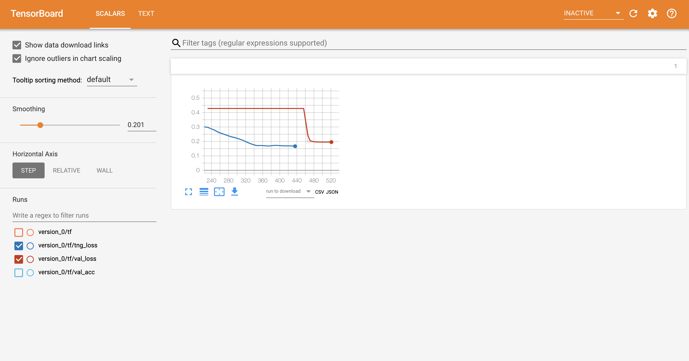
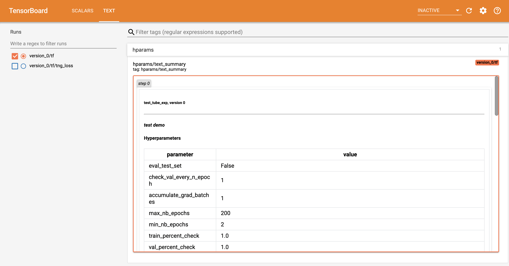

<div align="center">


# PyTorch Lightning

**The lightweight PyTorch wrapper for ML researchers. Scale your models. Write less boilerplate.**


[](https://badge.fury.io/py/pytorch-lightning)
[](https://pepy.tech/project/pytorch-lightning)
[](https://travis-ci.org/williamFalcon/pytorch-lightning)
[](https://ci.appveyor.com/project/Borda/pytorch-lightning)
[](https://github.com/williamFalcon/pytorch-lightning/tree/master/tests#running-coverage)
[](https://www.codefactor.io/repository/github/borda/pytorch-lightning)    

[](https://pytorch-lightning.readthedocs.io/en/latest)
[](https://gitter.im/PyTorch-Lightning/community?utm_source=badge&utm_medium=badge&utm_campaign=pr-badge)
[](https://github.com/williamFalcon/pytorch-lightning/blob/master/LICENSE)
[](https://shields.io/)

<!-- 
removed until codecov badge isn't empy. likely a config error showing nothing on master.
[](https://codecov.io/gh/Borda/pytorch-lightning)
-->

</div>

Simple installation from PyPI
```bash
pip install pytorch-lightning  
```

## Docs   
**[View the docs here](https://williamfalcon.github.io/pytorch-lightning/)**

## What is it?  
Lightning is a very lightweight wrapper on PyTorch. This means you don't have to learn a new library. To use Lightning, simply refactor your research code into the [LightningModule](https://github.com/williamFalcon/pytorch-lightning#how-do-i-do-use-it) format and Lightning will automate the rest. Lightning guarantees tested, correct, modern best practices for the automated parts.

## Starting a new project?   
[Use our seed-project aimed at reproducibility!](https://github.com/williamFalcon/pytorch-lightning-conference-seed)     

## Why do I want to use lightning?
Every research project starts the same, a model, a training loop, validation loop, etc. As your research advances, you're likely to need distributed training, 16-bit precision, checkpointing, gradient accumulation, etc.   

Lightning sets up all the boilerplate state-of-the-art training for you so you can focus on the research.   

---
 
## README Table of Contents        
- [How do I use it](https://github.com/williamFalcon/pytorch-lightning#how-do-i-do-use-it)     
- [What lightning automates](https://github.com/williamFalcon/pytorch-lightning#what-does-lightning-control-for-me)    
- [Tensorboard integration](https://github.com/williamFalcon/pytorch-lightning#tensorboard)    
- [Lightning features](https://github.com/williamFalcon/pytorch-lightning#lightning-automates-all-of-the-following-each-is-also-configurable)    
- [Examples](https://github.com/williamFalcon/pytorch-lightning#examples)    
- [Tutorials](https://github.com/williamFalcon/pytorch-lightning#tutorials)
- [Contributing](https://github.com/williamFalcon/pytorch-lightning/blob/master/CONTRIBUTING.md)    
- [Bleeding edge install](https://github.com/williamFalcon/pytorch-lightning#bleeding-edge)   
- [Lightning Design Principles](https://github.com/williamFalcon/pytorch-lightning#lightning-design-principles)   
- [Asking for help](https://github.com/williamFalcon/pytorch-lightning#asking-for-help)
- [FAQ](https://github.com/williamFalcon/pytorch-lightning#faq)    

---

## How do I do use it?   
Think about Lightning as refactoring your research code instead of using a new framework. The research code goes into a [LightningModule]((https://williamfalcon.github.io/pytorch-lightning/LightningModule/RequiredTrainerInterface/)) which you fit using a Trainer.    

The LightningModule defines a *system* such as seq-2-seq, GAN, etc... It can ALSO define a simple classifier such as the example below.     

To use lightning do 2 things:  
1. [Define a LightningModule](https://williamfalcon.github.io/pytorch-lightning/LightningModule/RequiredTrainerInterface/)     

**WARNING:** This syntax is for version 0.5.0+ where abbreviations were removed.    
```python
import os
import torch
from torch.nn import functional as F
from torch.utils.data import DataLoader
from torchvision.datasets import MNIST
import torchvision.transforms as transforms

import pytorch_lightning as pl

class CoolSystem(pl.LightningModule):

    def __init__(self):
        super(CoolSystem, self).__init__()
        # not the best model...
        self.l1 = torch.nn.Linear(28 * 28, 10)

    def forward(self, x):
        return torch.relu(self.l1(x.view(x.size(0), -1)))

    def training_step(self, batch, batch_nb):
        # REQUIRED
        x, y = batch
        y_hat = self.forward(x)
        loss = F.cross_entropy(y_hat, y)
        tensorboard_logs = {'train_loss': loss}
        return {'loss': loss, 'log': tensorboard_logs}

    def validation_step(self, batch, batch_nb):
        # OPTIONAL
        x, y = batch
        y_hat = self.forward(x)
        return {'val_loss': F.cross_entropy(y_hat, y)}

    def validation_end(self, outputs):
        # OPTIONAL
        avg_loss = torch.stack([x['val_loss'] for x in outputs]).mean()
        tensorboard_logs = {'val_loss': avg_loss}
        return {'avg_val_loss': avg_loss, 'log': tensorboard_logs}

    def configure_optimizers(self):
        # REQUIRED
        # can return multiple optimizers and learning_rate schedulers
        # (LBFGS it is automatically supported, no need for closure function)
        return torch.optim.Adam(self.parameters(), lr=0.02)

    @pl.data_loader
    def train_dataloader(self):
        # REQUIRED
        return DataLoader(MNIST(os.getcwd(), train=True, download=True, transform=transforms.ToTensor()), batch_size=32)

    @pl.data_loader
    def val_dataloader(self):
        # OPTIONAL
        return DataLoader(MNIST(os.getcwd(), train=True, download=True, transform=transforms.ToTensor()), batch_size=32)

    @pl.data_loader
    def test_dataloader(self):
        # OPTIONAL
        return DataLoader(MNIST(os.getcwd(), train=True, download=True, transform=transforms.ToTensor()), batch_size=32)
```
2. Fit with a [trainer](https://williamfalcon.github.io/pytorch-lightning/Trainer/)    
```python
from pytorch_lightning import Trainer

model = CoolSystem()

# most basic trainer, uses good defaults
trainer = Trainer()    
trainer.fit(model)   
```     

Trainer sets up a tensorboard logger, early stopping and checkpointing by default (you can modify all of them or
use something other than tensorboard).   

Here are more advanced examples
```python   
# train on cpu using only 10% of the data (for demo purposes)
trainer = Trainer(max_nb_epochs=1, train_percent_check=0.1)

# train on 4 gpus (lightning chooses GPUs for you)
# trainer = Trainer(max_nb_epochs=1, gpus=4)  

# train on 4 gpus (you choose GPUs)
# trainer = Trainer(max_nb_epochs=1, gpus=[0, 1, 3, 7])   

# train on 32 gpus across 4 nodes (make sure to submit appropriate SLURM job)
# trainer = Trainer(max_nb_epochs=1, gpus=8, nb_gpu_nodes=4)

# train (1 epoch only here for demo)
trainer.fit(model)

# view tensorboard logs 
print('View tensorboard logs by running\ntensorboard --logdir %s' % os.getcwd())
print('and going to http://localhost:6006 on your browser')
```    

When you're all done you can even run the test set separately.   
```python
trainer.test()
```

## What does lightning control for me?   

Everything in gray!    
You define the blue parts using the LightningModule interface:  


```python
# what to do in the training loop
def training_step(self, batch, batch_nb):

# what to do in the validation loop
def validation_step(self, batch, batch_nb):

# how to aggregate validation_step outputs
def validation_end(self, outputs):

# and your dataloaders
def train_dataloader():
def val_dataloader():
def test_dataloader():
```

**Could be as complex as seq-2-seq + attention**    

```python
# define what happens for training here
def training_step(self, batch, batch_nb):
    x, y = batch
    
    # define your own forward and loss calculation
    hidden_states = self.encoder(x)
     
    # even as complex as a seq-2-seq + attn model
    # (this is just a toy, non-working example to illustrate)
    start_token = '<SOS>'
    last_hidden = torch.zeros(...)
    loss = 0
    for step in range(max_seq_len):
        attn_context = self.attention_nn(hidden_states, start_token)
        pred = self.decoder(start_token, attn_context, last_hidden) 
        last_hidden = pred
        pred = self.predict_nn(pred)
        loss += self.loss(last_hidden, y[step])
        
    #toy example as well
    loss = loss / max_seq_len
    return {'loss': loss} 
```

**Or as basic as CNN image classification**      

```python
# define what happens for validation here
def validation_step(self, batch, batch_nb):    
    x, y = batch
    
    # or as basic as a CNN classification
    out = self.forward(x)
    loss = my_loss(out, y)
    return {'loss': loss} 
```

**And you also decide how to collate the output of all validation steps**    

```python
def validation_end(self, outputs):
    """
    Called at the end of validation to aggregate outputs
    :param outputs: list of individual outputs of each validation step
    :return:
    """
    val_loss_mean = 0
    val_acc_mean = 0
    for output in outputs:
        val_loss_mean += output['val_loss']
        val_acc_mean += output['val_acc']

    val_loss_mean /= len(outputs)
    val_acc_mean /= len(outputs)
    logs = {'val_loss': val_loss_mean.item(), 'val_acc': val_acc_mean.item()}
    result = {'log': logs}
    return result
```
   
## Tensorboard    
Lightning is fully integrated with tensorboard, MLFlow and supports any logging module.   



Lightning also adds a text column with all the hyperparameters for this experiment.      



## Lightning automates all of the following ([each is also configurable](https://williamfalcon.github.io/pytorch-lightning/Trainer/)):

#### Checkpointing    

- [Checkpoint callback](https://williamfalcon.github.io/pytorch-lightning/Trainer/Checkpointing/#model-saving)
- [Model saving](https://williamfalcon.github.io/pytorch-lightning/Trainer/Checkpointing/#model-saving)
- [Model loading](https://williamfalcon.github.io/pytorch-lightning/LightningModule/methods/#load-from-metrics) 
- [Restoring training session](https://williamfalcon.github.io/pytorch-lightning/Trainer/Checkpointing/#restoring-training-session)

#### Computing cluster (SLURM)    

- [Running grid search on a cluster](https://williamfalcon.github.io/pytorch-lightning/Trainer/SLURM%20Managed%20Cluster#running-grid-search-on-a-cluster) 
- [Walltime auto-resubmit](https://williamfalcon.github.io/pytorch-lightning/Trainer/SLURM%20Managed%20Cluster#walltime-auto-resubmit)   

#### Debugging  

- [Fast dev run](https://williamfalcon.github.io/pytorch-lightning/Trainer/debugging/#fast-dev-run)
- [Inspect gradient norms](https://williamfalcon.github.io/pytorch-lightning/Trainer/debugging/#inspect-gradient-norms)
- [Log GPU usage](https://williamfalcon.github.io/pytorch-lightning/Trainer/debugging/#Log-gpu-usage)
- [Make model overfit on subset of data](https://williamfalcon.github.io/pytorch-lightning/Trainer/debugging/#make-model-overfit-on-subset-of-data)
- [Print the parameter count by layer](https://williamfalcon.github.io/pytorch-lightning/Trainer/debugging/#print-the-parameter-count-by-layer)
- [Print which gradients are nan](https://williamfalcon.github.io/pytorch-lightning/Trainer/debugging/#print-which-gradients-are-nan)
- [Print input and output size of every module in system](https://williamfalcon.github.io/pytorch-lightning/LightningModule/properties/#example_input_array)


#### Distributed training    

- [16-bit mixed precision](https://williamfalcon.github.io/pytorch-lightning/Trainer/Distributed%20training/#16-bit-mixed-precision)
- [Multi-GPU](https://williamfalcon.github.io/pytorch-lightning/Trainer/Distributed%20training/#Multi-GPU)
- [Multi-node](https://williamfalcon.github.io/pytorch-lightning/Trainer/Distributed%20training/#Multi-node)
- [Single GPU](https://williamfalcon.github.io/pytorch-lightning/Trainer/Distributed%20training/#single-gpu)
- [Self-balancing architecture](https://williamfalcon.github.io/pytorch-lightning/Trainer/Distributed%20training/#self-balancing-architecture)


#### Experiment Logging   

- [Display metrics in progress bar](https://williamfalcon.github.io/pytorch-lightning/Trainer/Logging/#display-metrics-in-progress-bar)
- [Log metric row every k batches](https://williamfalcon.github.io/pytorch-lightning/Trainer/Logging/#log-metric-row-every-k-batches)
- [Process position](https://williamfalcon.github.io/pytorch-lightning/Trainer/Logging/#process-position)
- [Tensorboard support](https://williamfalcon.github.io/pytorch-lightning/Trainer/Logging/#tensorboard-support)
- [Save a snapshot of all hyperparameters](https://williamfalcon.github.io/pytorch-lightning/Trainer/Logging/#save-a-snapshot-of-all-hyperparameters) 
- [Snapshot code for a training run](https://williamfalcon.github.io/pytorch-lightning/Trainer/Logging/#snapshot-code-for-a-training-run) 
- [Write logs file to csv every k batches](https://williamfalcon.github.io/pytorch-lightning/Trainer/Logging/#write-logs-file-to-csv-every-k-batches)

#### Training loop    

- [Accumulate gradients](https://williamfalcon.github.io/pytorch-lightning/Trainer/Training%20Loop/#accumulated-gradients)
- [Force training for min or max epochs](https://williamfalcon.github.io/pytorch-lightning/Trainer/Training%20Loop/#force-training-for-min-or-max-epochs)
- [Early stopping callback](https://williamfalcon.github.io/pytorch-lightning/Trainer/Training%20Loop/#early-stopping)
- [Force disable early stop](https://williamfalcon.github.io/pytorch-lightning/Trainer/Training%20Loop/#force-disable-early-stop)
- [Gradient Clipping](https://williamfalcon.github.io/pytorch-lightning/Trainer/Training%20Loop/#gradient-clipping)
- [Hooks](https://williamfalcon.github.io/pytorch-lightning/Trainer/hooks/)
- [Learning rate scheduling](https://williamfalcon.github.io/pytorch-lightning/LightningModule/RequiredTrainerInterface/#configure_optimizers)    
- [Use multiple optimizers (like GANs)](https://williamfalcon.github.io/pytorch-lightning/LightningModule/RequiredTrainerInterface/#configure_optimizers)
- [Set how much of the training set to check (1-100%)](https://williamfalcon.github.io/pytorch-lightning/Trainer/Training%20Loop/#set-how-much-of-the-training-set-to-check)
- [Step optimizers at arbitrary intervals](https://williamfalcon.github.io/pytorch-lightning/Trainer/hooks/#optimizer_step)

#### Validation loop    

- [Check validation every n epochs](https://williamfalcon.github.io/pytorch-lightning/Trainer/Validation%20loop/#check-validation-every-n-epochs)
- [Hooks](https://williamfalcon.github.io/pytorch-lightning/Trainer/hooks/)
- [Set how much of the validation set to check](https://williamfalcon.github.io/pytorch-lightning/Trainer/Validation%20loop/#set-how-much-of-the-validation-set-to-check)
- [Set how much of the test set to check](https://williamfalcon.github.io/pytorch-lightning/Trainer/Validation%20loop/#set-how-much-of-the-test-set-to-check)
- [Set validation check frequency within 1 training epoch](https://williamfalcon.github.io/pytorch-lightning/Trainer/Validation%20loop/#set-validation-check-frequency-within-1-training-epoch)
- [Set the number of validation sanity steps](https://williamfalcon.github.io/pytorch-lightning/Trainer/Validation%20loop/#set-the-number-of-validation-sanity-steps)

#### Testing loop  
- [Run test set](https://williamfalcon.github.io/pytorch-lightning/Trainer/Testing%20loop/)  

## Examples   
- [GAN](https://github.com/williamFalcon/pytorch-lightning/tree/master/examples/domain_templates/gan.py)    
- [MNIST](https://github.com/williamFalcon/pytorch-lightning/tree/master/examples/basic_examples)      
- [Other projects using Lightning](https://github.com/williamFalcon/pytorch-lightning/network/dependents?package_id=UGFja2FnZS0zNzE3NDU4OTM%3D)    
- [Multi-node](https://github.com/williamFalcon/pytorch-lightning/tree/master/examples/multi_node_examples)   

## Tutorials   
- [Basic Lightning use](https://towardsdatascience.com/supercharge-your-ai-research-with-pytorch-lightning-337948a99eec)    
- [9 key speed features in Pytorch-Lightning](https://towardsdatascience.com/9-tips-for-training-lightning-fast-neural-networks-in-pytorch-8e63a502f565)    
- [SLURM, multi-node training with Lightning](https://towardsdatascience.com/trivial-multi-node-training-with-pytorch-lightning-ff75dfb809bd)     

---    
## Asking for help    
Welcome to the Lightning community!   

If you have any questions, feel free to:   
1. [read the docs](https://williamfalcon.github.io/pytorch-lightning/).     
2. [Search through the issues](https://github.com/williamFalcon/pytorch-lightning/issues?utf8=%E2%9C%93&q=my++question).      
3. [Ask on stackoverflow](https://stackoverflow.com/questions/ask?guided=false) with the tag pytorch-lightning.   

If no one replies to you quickly enough, feel free to post the stackoverflow link to our Gitter chat!   

To chat with the rest of us visit our [gitter channel](https://gitter.im/PyTorch-Lightning/community)!     

---   
## FAQ    
**How do I use Lightning for rapid research?**   
[Here's a walk-through](https://williamfalcon.github.io/pytorch-lightning/)  

**Why was Lightning created?**     
Lightning has 3 goals in mind:
1. Maximal flexibility while abstracting out the common boilerplate across research projects.   
2. Reproducibility. If all projects use the LightningModule template, it will be much much easier to understand what's going on and where to look! It will also mean every implementation follows a standard format.   
3. Democratizing PyTorch power user features. Distributed training? 16-bit? know you need them but don't want to take the time to implement? All good... these come built into Lightning.    

**How does Lightning compare with Ignite and fast.ai?**     
[Here's a thorough comparison](https://medium.com/@_willfalcon/pytorch-lightning-vs-pytorch-ignite-vs-fast-ai-61dc7480ad8a).    

**Is this another library I have to learn?**    
Nope! We use pure Pytorch everywhere and don't add unecessary abstractions!   

**Are there plans to support Python 2?**          
Nope.     

**Are there plans to support virtualenv?**    
Nope. Please use anaconda or miniconda.    

**Which PyTorch versions do you support?**    
- **PyTorch 1.1.0**       
    ```bash    
    # install pytorch 1.1.0 using the official instructions   
    
    # install test-tube 0.6.7.6 which supports 1.1.0   
    pip install test-tube==0.6.7.6   
    
    # install latest Lightning version without upgrading deps    
    pip install -U --no-deps pytorch-lightning
    ```     
- **PyTorch 1.2.0**
    Install via pip as normal   

## Custom installation

### Bleeding edge

If you can't wait for the next release, install the most up to date code with:
* using GIT (locally clone whole repo with full history)
    ```bash
    pip install git+https://github.com/williamFalcon/pytorch-lightning.git@master --upgrade
    ```
* using instant zip (last state of the repo without git history)
    ```bash
    pip install https://github.com/williamFalcon/pytorch-lightning/archive/master.zip --upgrade
    ```

### Any release installation

You can also install any past release from this repository:
```bash
pip install https://github.com/williamFalcon/pytorch-lightning/archive/0.4.4.zip --upgrade
```
