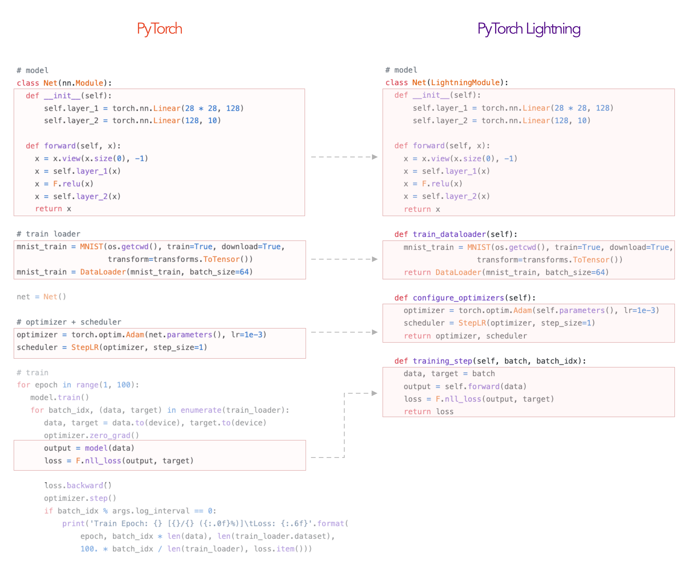
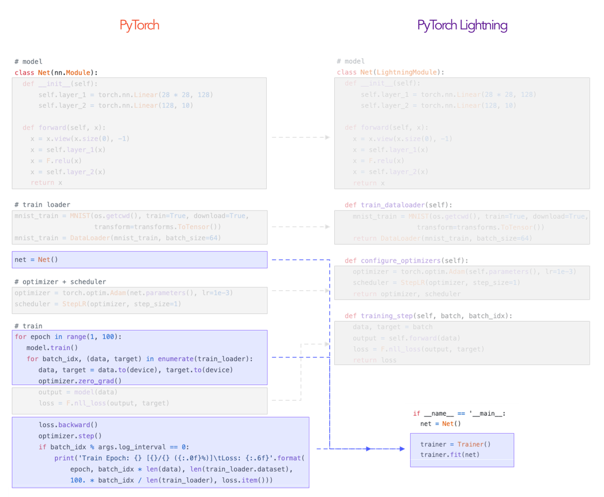
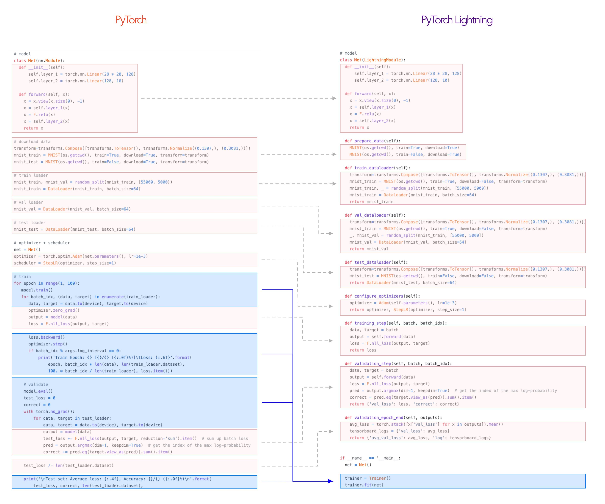

<div align="center">


# PyTorch Lightning

**The lightweight PyTorch wrapper for ML researchers. Scale your models. Write less boilerplate.**


[](https://badge.fury.io/py/pytorch-lightning)
[](https://pepy.tech/project/pytorch-lightning)
[](https://codecov.io/gh/PyTorchLightning/pytorch-lightning)
[](https://www.codefactor.io/repository/github/pytorchlightning/pytorch-lightning)

[](https://pytorch-lightning.readthedocs.io/en/stable/)
[](https://join.slack.com/t/pytorch-lightning/shared_invite/enQtODU5ODIyNTUzODQwLTFkMDg5Mzc1MDBmNjEzMDgxOTVmYTdhYjA1MDdmODUyOTg2OGQ1ZWZkYTQzODhhNzdhZDA3YmNhMDhlMDY4YzQ)
[](https://github.com/PytorchLightning/pytorch-lightning/blob/master/LICENSE)
[](https://shields.io/)

<!--
removed until codecov badge isn't empy. likely a config error showing nothing on master.
[](https://codecov.io/gh/Borda/pytorch-lightning)
-->
</div>

---
## Continuous Integration
<center>

| System / PyTorch ver. | 1.1 | 1.2 | 1.3 | 1.4 |
| :---: | :---: | :---: | :---: | :---: |
| Linux py3.6 [CPU] | [](https://circleci.com/gh/PyTorchLightning/pytorch-lightning) | [](https://circleci.com/gh/PyTorchLightning/pytorch-lightning) | [](https://circleci.com/gh/PyTorchLightning/pytorch-lightning) | [](https://circleci.com/gh/PyTorchLightning/pytorch-lightning) |
| Linux py3.7 [GPU] | - | - | - | [](http://35.192.60.23/PyTorchLightning/pytorch-lightning) |
| Linux py3.6 / py3.7 / py3.8 | [](https://github.com/PyTorchLightning/pytorch-lightning/actions?query=workflow%3A%22CI+testing%22) | - | - | [](https://github.com/PyTorchLightning/pytorch-lightning/actions?query=workflow%3A%22CI+testing%22) |
| OSX py3.6 / py3.7 / py3.8| [](https://github.com/PyTorchLightning/pytorch-lightning/actions?query=workflow%3A%22CI+testing%22) | - | - | [](https://github.com/PyTorchLightning/pytorch-lightning/actions?query=workflow%3A%22CI+testing%22) |
| Windows py3.6 / py3.7 / py3.8 | [](https://github.com/PyTorchLightning/pytorch-lightning/actions?query=workflow%3A%22CI+testing%22) | - | - | [](https://github.com/PyTorchLightning/pytorch-lightning/actions?query=workflow%3A%22CI+testing%22) |

</center>

Simple installation from PyPI
```bash
pip install pytorch-lightning
```

## Docs
- [master](https://pytorch-lightning.readthedocs.io/en/latest)
- [0.7.3](https://pytorch-lightning.readthedocs.io/en/0.7.3/)
- [0.7.1](https://pytorch-lightning.readthedocs.io/en/0.7.1/)
- [0.6.0](https://pytorch-lightning.readthedocs.io/en/0.6.0/)
- [0.5.3.2](https://pytorch-lightning.readthedocs.io/en/0.5.3.2/)

## Demo
[MNIST, GAN, BERT, DQN on COLAB!](https://colab.research.google.com/drive/1F_RNcHzTfFuQf-LeKvSlud6x7jXYkG31#scrollTo=HOk9c4_35FKg)   
[MNIST on TPUs](https://colab.research.google.com/drive/1-_LKx4HwAxl5M6xPJmqAAu444LTDQoa3)

## What is it?
Lightning is a way to organize your PyTorch code to decouple the science code from the engineering. It's more of a style-guide than a framework.

In Lightning, you organize your code into 3 distinct categories:

1. Research code (goes in the LightningModule).
2. Engineering code (you delete, and is handled by the Trainer).
3. Non-essential research code (logging, etc... this goes in Callbacks).

Here's an example of how to refactor your research code into a [LightningModule](https://pytorch-lightning.readthedocs.io/en/latest/lightning-module.html).



The rest of the code is automated by the [Trainer](https://pytorch-lightning.readthedocs.io/en/latest/trainer.html)!


## Testing Rigour
All the automated code by the Trainer is [tested rigorously with every new PR](https://github.com/PyTorchLightning/pytorch-lightning/tree/master/tests).

In fact, we also train a few models using a vanilla PyTorch loop and compare with the same model trained using the Trainer to make sure we achieve the EXACT same results. [Check out the parity tests here](https://github.com/PyTorchLightning/pytorch-lightning/tree/master/benchmarks).

Overall, Lightning guarantees rigorously tested, correct, modern best practices for the automated parts.

## How flexible is it?
As you see, you're just organizing your PyTorch code - there's no abstraction.

And for the stuff that the Trainer abstracts out you can [override any part](https://pytorch-lightning.readthedocs.io/en/latest/introduction_guide.html#extensibility) you want to do things like implement your own distributed training, 16-bit precision, or even a custom backwards pass.

For example, here you could do your own backward pass

```python
class LitModel(LightningModule):
  def optimizer_step(self, current_epoch, batch_idx, optimizer, optimizer_idx,
                     second_order_closure=None):
      optimizer.step()
      optimizer.zero_grad()
```

For anything else you might need, we have an extensive [callback system](https://pytorch-lightning.readthedocs.io/en/latest/introduction_guide.html#callbacks) you can use to add arbitrary functionality not implemented by our team in the Trainer.

## Who is Lightning for?
- Professional researchers
- PhD students
- Corporate production teams

If you're just getting into deep learning, we recommend you learn PyTorch first! Once you've implemented a few models, come back and use all the advanced features of Lightning :)

## What does lightning control for me?

Everything in Blue!
This is how lightning separates the science (red) from the engineering (blue).


## How much effort is it to convert?
If your code is not a huge mess you should be able to organize it into a LightningModule in less than 1 hour.
If your code IS a mess, then you needed to clean up anyhow ;)

[Check out this step-by-step guide](https://towardsdatascience.com/from-pytorch-to-pytorch-lightning-a-gentle-introduction-b371b7caaf09).


## Starting a new project?
[Use our seed-project aimed at reproducibility!](https://github.com/PytorchLightning/pytorch-lightning-conference-seed)

## Why do I want to use lightning?
Although your research/production project might start simple, once you add things like GPU AND TPU training, 16-bit precision, etc, you end up spending more time engineering than researching. Lightning automates AND rigorously tests those parts for you.

## Support
- [8 core contributors](https://pytorch-lightning.readthedocs.io/en/latest/governance.html) who are all a mix of professional engineers, Research Scientists, PhD students from top AI labs. 
- 100+ community contributors.

Lightning is also part of the [PyTorch ecosystem](https://pytorch.org/ecosystem/) which requires projects to have solid testing, documentation and support.

---

## README Table of Contents
- [How do I use it](https://github.com/PytorchLightning/pytorch-lightning#how-do-i-do-use-it)
- [What lightning automates](https://github.com/PytorchLightning/pytorch-lightning#what-does-lightning-control-for-me)
- [Tensorboard integration](https://github.com/PytorchLightning/pytorch-lightning#tensorboard)
- [Lightning features](https://github.com/PytorchLightning/pytorch-lightning#lightning-automates-all-of-the-following-each-is-also-configurable)
- [Examples](https://github.com/PytorchLightning/pytorch-lightning#examples)
- [Tutorials](https://github.com/PytorchLightning/pytorch-lightning#tutorials)
- [Asking for help](https://github.com/PytorchLightning/pytorch-lightning#asking-for-help)
- [Contributing](https://github.com/PytorchLightning/pytorch-lightning/blob/master/.github/CONTRIBUTING.md)
- [Bleeding edge install](https://github.com/PytorchLightning/pytorch-lightning#bleeding-edge)
- [Lightning Design Principles](https://github.com/PytorchLightning/pytorch-lightning#lightning-design-principles)
- [Lightning team](https://github.com/PytorchLightning/pytorch-lightning#lightning-team)
- [FAQ](https://github.com/PytorchLightning/pytorch-lightning#faq)

---

## Realistic example
Here's how you would organize a realistic PyTorch project into Lightning.



The LightningModule defines a *system* such as seq-2-seq, GAN, etc...
It can ALSO define a simple classifier.

In summary, you:

1. Define a [LightningModule](https://pytorch-lightning.rtfd.io/en/latest/lightning-module.html)
```python
    class LitSystem(pl.LightningModule):

        def __init__(self):
            super().__init__()
            # not the best model...
            self.l1 = torch.nn.Linear(28 * 28, 10)

        def forward(self, x):
            return torch.relu(self.l1(x.view(x.size(0), -1)))

        def training_step(self, batch, batch_idx):
            ...
```

2. Fit it with a [Trainer](https://pytorch-lightning.rtfd.io/en/latest/pytorch_lightning.trainer.html)
 ```python
 from pytorch_lightning import Trainer

 model = LitSystem()

 # most basic trainer, uses good defaults
 trainer = Trainer()
 trainer.fit(model)
 ```

[Check out the COLAB demo here](https://colab.research.google.com/drive/1F_RNcHzTfFuQf-LeKvSlud6x7jXYkG31#scrollTo=HOk9c4_35FKg)

## What types of research works?
Anything! Remember, that this is just organized PyTorch code.
The Training step defines the core complexity found in the training loop.

#### Could be as complex as a seq2seq

```python
# define what happens for training here
def training_step(self, batch, batch_idx):
    x, y = batch

    # define your own forward and loss calculation
    hidden_states = self.encoder(x)

    # even as complex as a seq-2-seq + attn model
    # (this is just a toy, non-working example to illustrate)
    start_token = '<SOS>'
    last_hidden = torch.zeros(...)
    loss = 0
    for step in range(max_seq_len):
        attn_context = self.attention_nn(hidden_states, start_token)
        pred = self.decoder(start_token, attn_context, last_hidden)
        last_hidden = pred
        pred = self.predict_nn(pred)
        loss += self.loss(last_hidden, y[step])

    #toy example as well
    loss = loss / max_seq_len
    return {'loss': loss}
```

#### Or as basic as CNN image classification

```python
# define what happens for validation here
def validation_step(self, batch, batch_idx):
    x, y = batch

    # or as basic as a CNN classification
    out = self(x)
    loss = my_loss(out, y)
    return {'loss': loss}
```

And without changing a single line of code, you could run on CPUs
```python
trainer = Trainer(max_epochs=1)
```


Or GPUs
```python
# 8 GPUs
trainer = Trainer(max_epochs=1, gpus=8)

# 256 GPUs
trainer = Trainer(max_epochs=1, gpus=8, num_nodes=32)
```

Or TPUs
```python
trainer = Trainer(num_tpu_cores=8)
```

When you're done training, run the test accuracy
```python
trainer.test()
```

## Visualization
Lightning has out-of-the-box integration with the popular logging/visualizing frameworks

- [Tensorboard](https://pytorch.org/docs/stable/tensorboard.html)
- [MLFlow](https://mlflow.org/)
- [Neptune.ai](https://neptune.ai/)
- [Comet.ml](https://www.comet.ml/site/)
- [Wandb](https://www.wandb.com/)
- [Trains](https://github.com/allegroai/trains)
- ...  


## Lightning automates 40+ parts of DL/ML research
- GPU training
- Distributed GPU (cluster) training
- TPU training
- EarlyStopping
- Logging/Visualizing
- Checkpointing
- Experiment management
- [Full list here](https://pytorch-lightning.readthedocs.io/en/latest/#common-use-cases)


## Examples
Check out this awesome list of research papers and implementations done with Lightning.

- [Contextual Emotion Detection (DoubleDistilBert)](https://github.com/PyTorchLightning/emotion_transformer)
- [Generative Adversarial Network](https://colab.research.google.com/drive/1F_RNcHzTfFuQf-LeKvSlud6x7jXYkG31#scrollTo=TyYOdg8g77P0)
- [Hyperparameter optimization with Optuna](https://github.com/optuna/optuna/blob/master/examples/pytorch_lightning_simple.py)
- [Image Inpainting using Partial Convolutions](https://github.com/ryanwongsa/Image-Inpainting)
- [MNIST on TPU](https://colab.research.google.com/drive/1-_LKx4HwAxl5M6xPJmqAAu444LTDQoa3#scrollTo=BHBz1_AnamN_)
- [NER (transformers, TPU, huggingface)](https://colab.research.google.com/drive/1dBN-wwYUngLYVt985wGs_OKPlK_ANB9D)
- [NeuralTexture (CVPR)](https://github.com/PyTorchLightning/neuraltexture)
- [Recurrent Attentive Neural Process](https://github.com/PyTorchLightning/attentive-neural-processes)
- [Siamese Nets for One-shot Image Recognition](https://github.com/PyTorchLightning/Siamese-Neural-Networks)
- [Speech Transformers](https://github.com/PyTorchLightning/speech-transformer-pytorch_lightning)
- [Transformers transfer learning (Huggingface)](https://colab.research.google.com/drive/1F_RNcHzTfFuQf-LeKvSlud6x7jXYkG31#scrollTo=yr7eaxkF-djf)
- [Transformers text classification](https://github.com/ricardorei/lightning-text-classification)
- [VAE Library of over 18+ VAE flavors](https://github.com/AntixK/PyTorch-VAE)

## Tutorials
Check out our [introduction guide](https://pytorch-lightning.readthedocs.io/en/latest/introduction_guide.html) to get started.
Or jump straight into [our tutorials](https://pytorch-lightning.readthedocs.io/en/latest/#tutorials).

---

## Asking for help
Welcome to the Lightning community!

If you have any questions, feel free to:
1. [read the docs](https://pytorch-lightning.rtfd.io/en/latest/).
2. [Search through the issues](https://github.com/PytorchLightning/pytorch-lightning/issues?utf8=%E2%9C%93&q=my++question).
3. [Ask on stackoverflow](https://stackoverflow.com/questions/ask?guided=false) with the tag pytorch-lightning.
4. [Join our slack](https://join.slack.com/t/pytorch-lightning/shared_invite/enQtODU5ODIyNTUzODQwLTFkMDg5Mzc1MDBmNjEzMDgxOTVmYTdhYjA1MDdmODUyOTg2OGQ1ZWZkYTQzODhhNzdhZDA3YmNhMDhlMDY4YzQ).

---
## FAQ
**How do I use Lightning for rapid research?**
[Here's a walk-through](https://pytorch-lightning.readthedocs.io/en/latest/introduction_guide.html)

**Why was Lightning created?**
Lightning has 3 goals in mind:

1. Maximal flexibility while abstracting out the common boilerplate across research projects.
2. Reproducibility. If all projects use the LightningModule template, it will be much much easier to understand what's going on and where to look! It will also mean every implementation follows a standard format.
3. Democratizing PyTorch power user features. Distributed training? 16-bit? know you need them but don't want to take the time to implement? All good... these come built into Lightning.

**How does Lightning compare with Ignite and fast.ai?**
[Here's a thorough comparison](https://medium.com/@_willfalcon/pytorch-lightning-vs-pytorch-ignite-vs-fast-ai-61dc7480ad8a).

**Is this another library I have to learn?**
Nope! We use pure Pytorch everywhere and don't add unnecessary abstractions!

**Are there plans to support Python 2?**
Nope.

**Are there plans to support virtualenv?**
Nope. Please use anaconda or miniconda.

**Which PyTorch versions do you support?**
- **PyTorch 1.1.0**
    ```bash
    # install pytorch 1.1.0 using the official instructions

    # install test-tube 0.6.7.6 which supports 1.1.0
    pip install test-tube==0.6.7.6

    # install latest Lightning version without upgrading deps
    pip install -U --no-deps pytorch-lightning
    ```
- **PyTorch 1.2.0, 1.3.0,**
    Install via pip as normal

## Custom installation

### Bleeding edge

If you can't wait for the next release, install the most up to date code with:
* using GIT (locally clone whole repo with full history)
    ```bash
    pip install git+https://github.com/PytorchLightning/pytorch-lightning.git@master --upgrade
    ```
* using instant zip (last state of the repo without git history)
    ```bash
    pip install https://github.com/PytorchLightning/pytorch-lightning/archive/master.zip --upgrade
    ```

### Any release installation

You can also install any past release `0.X.Y` from this repository:
```bash
pip install https://github.com/PytorchLightning/pytorch-lightning/archive/0.X.Y.zip --upgrade
```

### Lightning team

#### Leads
- William Falcon [(williamFalcon)](https://github.com/williamFalcon) (Lightning founder)
- Jirka Borovec [(Borda)](https://github.com/Borda) (ghost :)
- Ethan Harris [(ethanwharris)](https://github.com/ethanwharris) (Torchbearer founder)
- Matthew Painter [(MattPainter01)](https://github.com/MattPainter01) (Torchbearer founder)
- Justus Schock [(justusschock)](https://github.com/justusschock) (Former Core Member PyTorch Ignite)

#### Core Maintainers

- Nick Eggert [(neggert)](https://github.com/neggert)
- Jeff Ling [(jeffling)](https://github.com/jeffling)
- Jeremy Jordan [(jeremyjordan)](https://github.com/jeremyjordan)
- Tullie Murrell [(tullie)](https://github.com/tullie)

## Bibtex
If you want to cite the framework feel free to use this (but only if you loved it 😊):
```bibtex
@misc{Falcon2019,
  author = {Falcon, W.A. et al.},
  title = {PyTorch Lightning},
  year = {2019},
  publisher = {GitHub},
  journal = {GitHub repository},
  howpublished = {\url{https://github.com/PytorchLightning/pytorch-lightning}}
}
```
