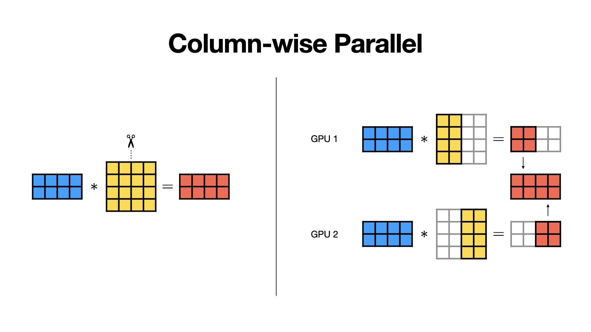
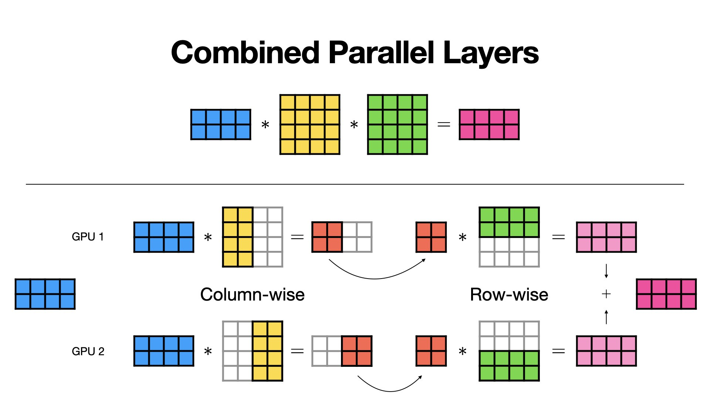

:orphan:

##################
Tensor Parallelism
##################

Tensor parallelism is a technique for training large models by distributing layers across multiple devices, improving memory management and efficiency by reducing inter-device communication.
However, for smaller models, the communication overhead may outweigh its benefits.
This method is most effective for very large models, significantly enhancing performance and memory efficiency.

----

************************************
Exploit parallelism in linear layers
************************************

In tensor parallelism, linear layers can be split in two ways.
Row-wise parallelism divides the rows of the weight matrix across devices, meaning each device handles different output features.
Column-wise parallelism splits the columns, so each device processes different input features.
Both methods help balance the work and reduce communication between devices.

.. figure:: tp-rowwise.jpeg
   :alt:
   :width: 100%

