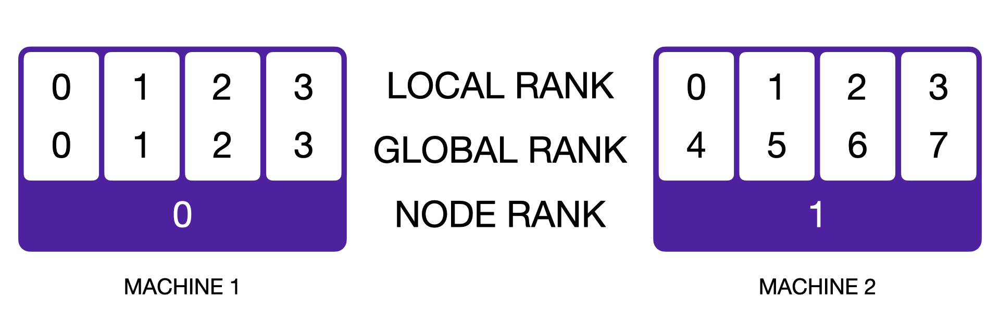
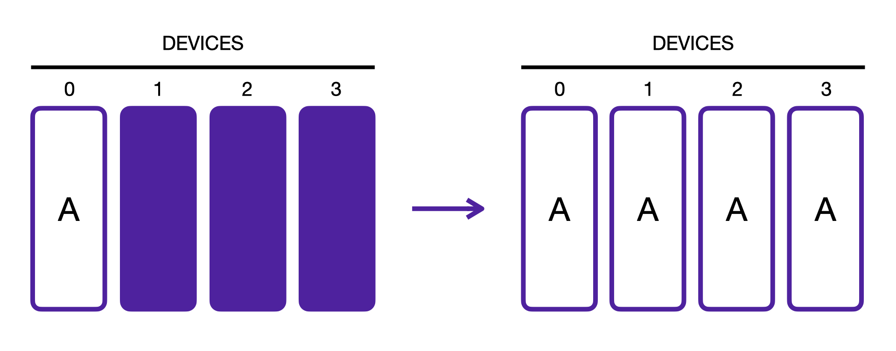
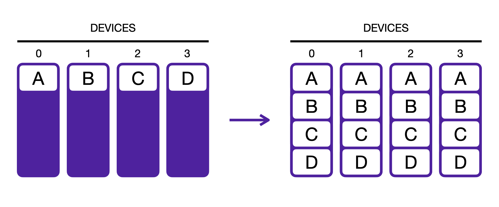
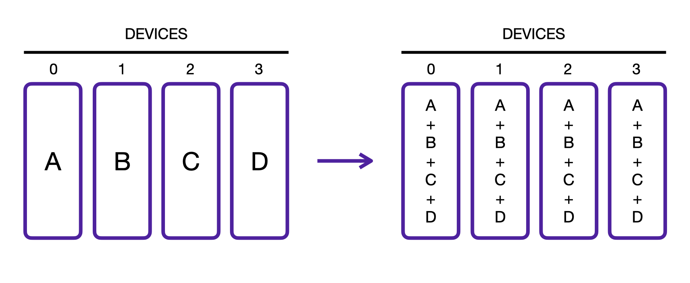
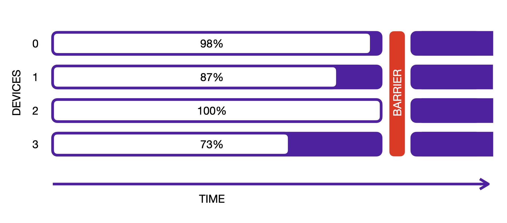

:orphan:

###########################################
Communication between distributed processes
###########################################

Fabric enables you to easily access information about a process or send data between processes with a standardized API and agnostic to the distributed strategy.

----

*******************
Rank and world size
*******************

.. code-block:: python

    # devices and num_nodes determine how many processes there are
    fabric = Fabric(devices=2, num_nodes=3)

    # The total number of processes running across all devices and nodes
    fabric.world_size  # 2 * 3 = 6

    # The global index of the current process across all devices and nodes
    fabric.global_rank

    # The index of the current process among the processes running on the local node
    fabric.local_rank

    # The index of the current node
    fabric.node_rank

    # Whether this global rank is rank zero.
    if fabric.is_global_zero:
        # do something on rank 0
        ...

----

*********
Broadcast
*********

.. code-block:: python

    fabric = Fabric(...)

    # Transfer an object from one process to all the others
    fabric.broadcast(..., src=...)

----

******
Gather
******

.. code-block:: python

    fabric = Fabric(...)

    # Transfer and concatenate tensors across processes
    fabric.all_gather(...)

----

******
Reduce
******

.. code-block:: python

    fabric = Fabric(...)

    # TODO
    fabric.all_reduce(...)

----

*******
Barrier
*******

.. code-block:: python

    fabric = Fabric(...)

    # Wait for all processes to enter this call.
    fabric.barrier()
