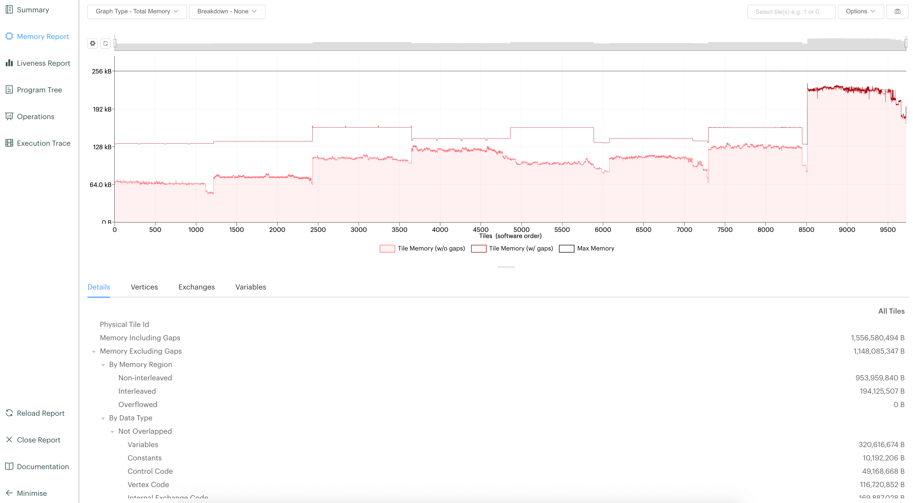

.. _ipu:

IPU support
===========

.. note::
    IPU Support is experimental and a work in progress (see :ref:`known-limitations`). If you run into an problems, please leave an issue.

Lightning supports `Graphcore Information Processing Units (IPUs) <https://www.graphcore.ai/products/ipu>`_, processors built for Artificial Intelligence and Machine Learning.

IPU Terminology
---------------

IPUs consist of many individual cores, allowing parallelization across computation. Due to the high bandwidth speed between cores,
IPUs facilitate machine learning loads where parallelization is essential. Because computation is heavily parallelized,
IPUs operate in a different way to conventional accelerators such as CPU/GPUs.
IPUs do not require large batch sizes for maximum parallelization, can provide optimizations across the compiled graph and rely on model parallelism to fully utilize cores for larger models.

IPUs are also found within IPU pods, a collection of IPU enabled machines for larger workloads.

How to access IPUs
------------------

To use IPUs you must have access to a server with IPU devices attached. To get access see `getting started <https://www.graphcore.ai/getstarted>`_.

Training with IPUs
------------------

Specify the number of IPUs to train with. Note that when training with IPUs, you must select 1 or a power of 2 number of IPUs (i.e. 2/4/8..).

.. code-block:: python

    trainer = pl.Trainer(ipus=8) # Train using data parallel on 8 IPUs

IPUs only support specifying a single number to allocate devices, which is handled via the underlying libraries.

Mixed Precision & 16 bit precision
----------------------------------

Lightning also supports training in mixed precision with IPUs.
By default, IPU training will use 32-bit precision. To enable mixed precision,
set the precision flag.

.. note::
    Currently there is no dynamic scaling of the loss with mixed precision training.

.. code-block:: python

    import pytorch_lightning as pl

    model = MyLightningModule()
    trainer = pl.Trainer(ipus=8, precision=16)
    trainer.fit(model)

You can also use pure 16-bit training, where the weights are also in 16 bit precision.

.. code-block:: python

    import pytorch_lightning as pl
    from pytorch_lightning.plugins import IPUPlugin

    model = MyLightningModule()
    trainer = pl.Trainer(ipus=8, precision=16, plugins=IPUPlugin(convert_model_to_half=True))
    trainer.fit(model)

Advanced IPU Options
--------------------

IPUs provide further optimizations to speed up training. By using the ``IPUPlugin`` we can set the ``device_iterations``, which controls the number of iterations run directly on the IPU devices before returning to host. Increasing the number of on device iterations will improve throughput as there is less device to host communication required.

.. note::

    When using model parallel, it is a hard requirement to increase the number of device iterations to ensure we fully saturate the devices via micro-batching. see :ref:`ipu-model-parallelism` for more information.

.. code-block:: python

    import pytorch_lightning as pl
    from pytorch_lightning.plugins import IPUPlugin

    model = MyLightningModule()
    trainer = pl.Trainer(ipus=8, plugins=IPUPlugin(device_iterations=32))
    trainer.fit(model)

Note that by default we return the last device iteration loss. You can override this by passing in your own ``poptorch.Options`` and setting the AnchorMode as described in the `poptorch documentation <https://docs.graphcore.ai/projects/poptorch-user-guide/en/latest/reference.html#poptorch.Options.anchorMode>`__.

.. code-block:: python

    import poptorch
    import pytorch_lightning as pl
    from pytorch_lightning.plugins import IPUPlugin

    model = MyLightningModule()
    inference_opts = poptorch.Options()
    inference_opts.deviceIterations(32)

    training_opts = poptorch.Options()
    training_opts.anchorMode(poptorch.AnchorMode.All)
    training_opts.deviceIterations(32)

    trainer = Trainer(
        ipus=8,
        plugins=IPUPlugin(inference_opts=inference_opts, training_opts=training_opts)
    )
    trainer.fit(model)

You can also override all options by passing the ``poptorch.Options`` to the plugin. See `poptorch options documentation <https://docs.graphcore.ai/projects/poptorch-user-guide/en/latest/batching.html>`_ for more information.

PopVision Graph Analyser
------------------------

Lightning supports integration with the `PopVision Graph Analyser Tool <https://docs.graphcore.ai/projects/graphcore-popvision-user-guide/en/latest/popvision.html>`__. This helps to look at utilization of IPU devices and provides helpful metrics during the lifecycle of your trainer. Once you have gained access, The PopVision Graph Analyser Tool can be downloaded via the `GraphCore download website <https://downloads.graphcore.ai/>`__.

Lightning supports dumping all reports to a directory to open using the tool.

.. code-block:: python

    import pytorch_lightning as pl
    from pytorch_lightning.plugins import IPUPlugin

    model = MyLightningModule()
    trainer = pl.Trainer(ipus=8, plugins=IPUPlugin(autoreport_dir='report_dir/'))
    trainer.fit(model)

This will dump all reports to ``report_dir/`` which can then be opened using the Graph Analyser Tool, see `Opening Reports <https://docs.graphcore.ai/projects/graphcore-popvision-user-guide/en/latest/graph/graph.html#opening-reports>`__.

.. _ipu-model-parallelism:

Model Parallelism
-----------------

Due to the IPU architecture, larger models should be parallelized across IPUs by design. Currently poptorch provides the capabilities via annotations as described in `Parallel Execution <https://docs.graphcore.ai/projects/poptorch-user-guide/en/latest/overview.html#id1>`__

Below is an example using the block annotation in a LightningModule.

.. note::

    Currently when using model parallelism, we do not infer the number of IPUs required for you. This is done via the annotations themselves. If you specify 4 different IDs when defining Blocks, this means your model will be split onto 4 different IPUs.

    This is also mutually exclusive with the Trainer flag, i.e. if your model is split onto 2 IPUs and you set ``Trainer(ipus=4)`` this will require 8 IPUs in total; replicating the model 4 times in data parallel.

    When pipelining the model you must also increase the `device_iterations` to ensure full data saturation of the devices data, i.e whilst one device in the model pipeline processes a batch of data, the other device can start on the next batch. For example if the model is split onto 4 IPUs, we require `device_iterations` to be at-least 4.

.. code-block:: python

    import pytorch_lightning as pl
    import poptorch

    class MyLightningModule(pl.LightningModule):

        def __init__(self):
            super().__init__()
            # This will place layer1, layer2+layer3, layer4, softmax on different IPUs at runtime.
            # BeginBlock will start a new id for all layers within this block
            self.layer1 = poptorch.BeginBlock(torch.nn.Linear(5, 10), ipu_id=0)

            # This layer starts a new block,
            # adding subsequent layers to this current block at runtime
            # till the next block has been declared
            self.layer2 = poptorch.BeginBlock(torch.nn.Linear(10, 5), ipu_id=1)
            self.layer3 = torch.nn.Linear(5, 5)

            # Create new blocks
            self.layer4 = poptorch.BeginBlock(torch.nn.Linear(5, 5), ipu_id=2)
            self.softmax = poptorch.BeginBlock(torch.nn.Softmax(dim=1), ipu_id=3)

        ...

    model = MyLightningModule()
    trainer = pl.Trainer(ipus=8, plugins=IPUPlugin(device_iterations=20))
    trainer.fit(model)

You can also use the block context manager within the forward function, or any of the step functions.

.. code-block:: python

    import pytorch_lightning as pl
    import poptorch

    class MyLightningModule(pl.LightningModule):

        def __init__(self):
            super().__init__()
            self.layer1 = torch.nn.Linear(5, 10)
            self.layer2 = torch.nn.Linear(10, 5)
            self.layer3 = torch.nn.Linear(5, 5)
            self.layer4 = torch.nn.Linear(5, 5)

            self.act = torch.nn.ReLU()
            self.softmax = torch.nn.Softmax(dim=1)

        def forward(self, x):

            with poptorch.Block(ipu_id=0):
                x = self.act(self.layer1(x))

            with poptorch.Block(ipu_id=1):
                x = self.act(self.layer2(x))

            with poptorch.Block(ipu_id=2):
                x = self.act(self.layer3(x))
                x = self.act(self.layer4(x))

            with poptorch.Block(ipu_id=3):
                x = self.softmax(x)
            return x
        ...

    model = MyLightningModule()
    trainer = pl.Trainer(ipus=8, plugins=IPUPlugin(device_iterations=20))
    trainer.fit(model)

.. _known-limitations:

Known Limitations
-----------------

Currently there are some known limitations that are being addressed in the near future to make the experience seamless when moving from different devices.

Please see the `MNIST example <https://github.com/PyTorchLightning/pytorch-lightning/blob/master/pl_examples/ipu_examples/mnist.py>`__ which displays most of the limitations and how to overcome them till they are resolved.

* ``self.log`` is not supported in the ``training_step``, ``validation_step``, ``test_step`` or ``predict_step``. This is due to the step function being traced and sent to the IPU devices. We're actively working on fixing this
* Multiple optimizers are not supported. ``training_step`` only supports returning one loss from the ``training_step`` function as a result
* Since the step functions are traced, branching logic or any form of primitive values are traced into constants. Be mindful as this could lead to errors in your custom code
