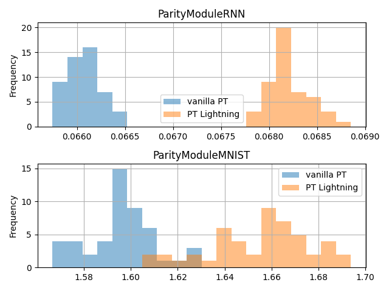

Benchmark with vanilla PyTorch
==============================

In this section we set grounds for comparison between vanilla PyTorch and PT Lightning for most common scenarios.

Time comparison
---------------

We have set regular benchmarking against PyTorch vanilla training loop on with RNN and simple MNIST classifier as per of out CI.
In average for simple MNIST CNN classifier we are only about 0.06s slower per epoch, see detail chart bellow.

