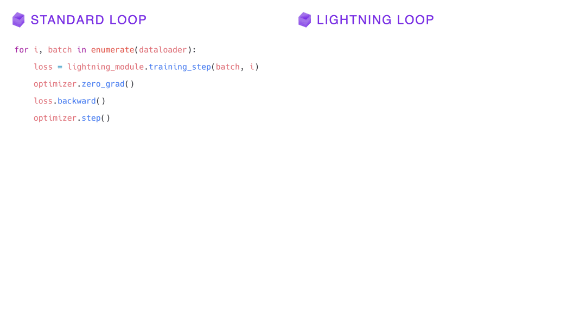
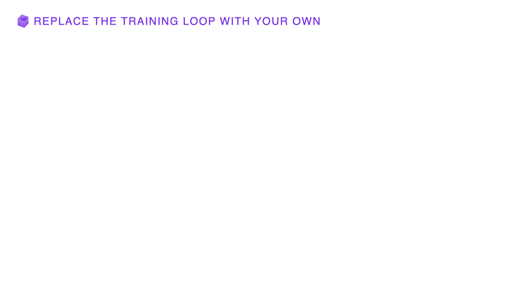

.. _loop_customization:

Loops
=====

The Lightning Trainer automates the optimization loop to save you from writing boilerplate. Need more control over the optimization scheme to try different training paradigms such as recommendation engine optimization or active learning? You can now customize the built-in Lightning training loop, providing an unprecedented level of flexibility.

With customized loops, you can not only customize Lightning down to its very core, but also build new functionalities on top of it.
Until now, Lightning did not support well some training paradigms like recommendation engine optimization or active learning.
The loop customization feature will not only enable researchers to customize Lightning down to its very core, but also allow one to build new functionalities on top of it.

The Built-in Training Loop
------------------------------

Every PyTorch user is familiar with the basic training loop for gradient descent optimization:

.. code-block:: python

    for i, batch in enumerate(dataloader):
        x, y = batch
        y_hat = model(x)
        loss = loss_function(y_hat, y)
        optimizer.zero_grad()
        loss.backward()
        optimizer.step()

At its core, the Lightning Trainer does not do anything different here.
It implements the same loop as shown above except that the research code stays in the LightningModule:

.. code-block:: python

    for i, batch in enumerate(dataloader):
        loss = lightning_module.training_step(batch, i)
        optimizer.zero_grad()
        loss.backward()
        optimizer.step()

The other operations are automated by the Lightning Trainer: :code:`zero_grad()`, :code:`backward()` and :code:`optimizer.step()` calls.
These are considered *boilerplate* and get automated by Lightning.

This optimization scheme is very general and applies to the vast majority of deep learning research today.
However, the loops and optimizer calls here remain predetermined in their order and are fully controlled by the Trainer.

Loop customization now enables a new level of control where also the two remaining `for` loops and more can be fully changed or replaced.

Here is how the above training loop can be defined using the new Loop API:

.. code-block:: python

    class EpochLoop(Loop):
        def advance(self):
            i, batch = next(self.iterator)
            loss = lightning_module.training_step(batch, i)
            optimizer.zero_grad()
            loss.backward()
            optimizer.step()

        def run(self, dataloader):
            self.iterator = enumerate(dataloader)
            while True:
                try:
                    self.advance()
                except StopIteration:
                    break

Defining a loop with a class interface instead of hard-coding a raw Python for/while loop has several benefits:

1. You can have full control over the data flow through loops
2. You can add new loops and nest as many of them as you want
3. If needed, the state of a loop can be saved and resumed
4. New hooks can be injected at any point

Which loops does Lightning have and how can they be changed?
------------------------------------------------------------

The Trainer has four entry points for training, testing and inference, and each method corresponds to a main loop:

.. list-table:: Trainer entry points and associated loops
   :widths: 25 25 25
   :header-rows: 1

   * - Entry point
     - Trainer attribute
     - Loop class
   * - :meth:`~pytorch_lightning.trainer.trainer.Trainer.fit`
     - :attr:`~pytorch_lightning.trainer.trainer.Trainer.fit_loop`
     - :class:`~pytorch_lightning.loops.fit_loop.FitLoop`
   * - :meth:`~pytorch_lightning.trainer.trainer.Trainer.validate`
     - :attr:`~pytorch_lightning.trainer.trainer.Trainer.validate_loop`
     - :class:`~pytorch_lightning.loops.dataloader.evaluation_loop.EvaluationLoop`
   * - :meth:`~pytorch_lightning.trainer.trainer.Trainer.test`
     - :attr:`~pytorch_lightning.trainer.trainer.Trainer.test_loop`
     - :class:`~pytorch_lightning.loops.dataloader.evaluation_loop.EvaluationLoop`
   * - :meth:`~pytorch_lightning.trainer.trainer.Trainer.predict`
     - :attr:`~pytorch_lightning.trainer.trainer.Trainer.predict_loop`
     - :class:`~pytorch_lightning.loops.dataloader.prediction_loop.PredictionLoop`

When the user calls :code:`Trainer.<entry-point>`, it redirects to the corresponding :code:`Trainer.loop.run()` which implements the main logic of that particular Lightning loop.
The :meth:`~pytorch_lightning.loops.base.Loop.run` method is part of the base :class:`~pytorch_lightning.loops.base.Loop` class that every loop inherits from (like every model inherits from LightningModule).

Customizing any of these entry point loops is simple:

**Step 1:** Subclass one of the above loop classes (or inherit `Loop` to start from scratch)

.. code-block:: python

    from pytorch_lightning.loops import FitLoop

    class MyLoop(FitLoop):
        ...

Alternatively, more advanced users can also implement a complete loop from scratch by inheriting directly from the base loop interface as explained later.

**Step 2:** Attach the loop to the Trainer and run it.

.. code-block:: python

    loop = MyLoop()
    trainer = Trainer()

    trainer.fit_loop = loop
    trainer.fit(model)

    # or
    trainer.validate_loop = loop
    trainer.validate(model)

    # or
    trainer.test_loop = loop
    trainer.test(model)

    # or
    trainer.predict_loop = loop
    trainer.predict(model)

Practical example: the training step as a generator
---------------------------------------------------

Lightning supports multiple optimizers and offers a special :code:`training_step` flavor for it, where an extra argument with the current optimizer being used is passed in.
Take as an example the following training step of a DCGAN from the `Lightning Bolts <https://github.com/PyTorchLightning/lightning-bolts/>`_ repository:

.. code-block:: python

    def training_step(self, batch, batch_idx, optimizer_idx):
        real, _ = batch

        # this gets computed in both cases:
        fake = self.generator(noise)

        # train discriminator
        if optimizer_idx == 0:
            # train with real
            real_pred = self.discriminator(real)
            real_loss = self.criterion(real_pred, ...)

            # train with fake
            fake_pred = self.discriminator(fake)
            fake_loss = self.criterion(fake_pred, ...)
            return real_loss + fake_loss

        # train generator
        if optimizer_idx == 1:
            fake_pred = self.discriminator(fake)
            gen_loss = self.criterion(fake_pred, fake_gt)
            return gen_loss

We notice here that the same generator `fake` outputs are needed in both optimizer cases, but if we wanted to share that computation between the two optimization steps for efficiency, there would be no elegant way to do so.
However, if we could :code:`yield` from the training step instead of returning, we can retain the local variables across training_step boundaries when we switch from one optimizer to the next in a natural way.
But such a mechanism does not exist in Lightning, therefore we need to build a custom loop for it!

.. code-block:: python

    from functools import partial
    from pytorch_lightning.loops import Loop, OptimizerLoop
    from pytorch_lightning.loops.optimization.optimizer_loop import ClosureResult
    from pytorch_lightning.loops.utilities import _build_training_step_kwargs

    class YieldLoop(OptimizerLoop):
        def __init__(self):
            super().__init__()
            self._generator = None

        def on_run_start(self, batch, optimizers, batch_idx):
            super().on_run_start(batch, optimizers, batch_idx)
            assert self.trainer.lightning_module.automatic_optimization

            # We request the generator once and save it for later
            # so we can call next() on it.
            self._generator = self._get_generator(batch, batch_idx, opt_idx=0)

        def _get_generator(self, batch, batch_idx, opt_idx):
            step_kwargs = _build_training_step_kwargs(
                self.trainer.lightning_module,
                self.trainer.optimizers,
                batch,
                batch_idx,
                opt_idx,
                hiddens=None,
            )

            # Here we are basically calling lightning_module.training_step()
            # and this returns a generator! The training_step is handled by the
            # accelerator to enable distributed training.
            generator = self.trainer.accelerator.training_step(step_kwargs)
            return generator

        def _make_step_fn(self, batch, batch_idx, opt_idx):
            return partial(self._training_step, self._generator)

        def _training_step(self, generator):
            lightning_module = self.trainer.lightning_module

            # Here, instead of calling lightning_module.training_step()
            # we call next() on the generator!
            training_step_output = next(generator)

            self.trainer.accelerator.post_training_step()
            training_step_output = self.trainer.call_hook(
                "training_step_end",
                training_step_output,
            )
            result = ClosureResult.from_training_step_output(
                training_step_output,
                self.trainer.accumulate_grad_batches,
            )
            return result

Here we subclass the existing :class:`~pytorch_lightning.loops.optimization.optimizer_loop.OptimizerLoop` and modify the way it interacts with the model's :code:`training_step`.
The new loop is called :code:`YieldLoop` and contains a reference to the generator returned by the :code:`training_step`.
On every new run (over the optimizers) we call the :code:`training_step` method on the LightningModule which is supposed to return a generator as it contains the :code:`yield` statements.
There must be as many :code:`yield` statements as there are optimizers.

The alternative to this example *manual optimization* where the same can be achieved, but with the generator loop we can still get all benefits of manual optimization without having to call backward or zero grad ourselves.

Given this new loop definition, here is how you connect it to the :code:`Trainer`:

.. code-block:: python

    model = LitModel()
    trainer = Trainer()

    yield_loop = YieldLoop()
    trainer.fit_loop.epoch_loop.batch_loop.connect(optimizer_loop=yield_loop)
    trainer.fit(model)  # runs the new loop!

Note that we need to connect it to the :class:`~pytorch_lightning.loops.batch.training_batch_loop.TrainingBatchLoop` as this is the next higher loop above the optimizer loop.

Finally, we can rewrite the GAN training step using the new yield mechanism:

.. code-block:: python

    def training_step(self, batch, batch_idx):
        real, _ = batch

        # this gets computed only once!
        fake = self.generator(noise)

        # train discriminator, then yield
        real_pred = self.discriminator(real)
        real_loss = self.criterion(real_pred, ...)
        fake_pred = self.discriminator(fake)
        fake_loss = self.criterion(fake_pred, ...)
        yield real_loss + fake_loss

        # train generator, then yield
        fake_pred = self.discriminator(fake)
        gen_loss = self.criterion(fake_pred, fake_gt)
        yield gen_loss

The Loop base class
-------------------

So far we have seen how it is possible to customize existing implementations of loops in Lightning, namely the FitLoop and the OptimizerLoop.
This is an appropriate approach when just a few details need change.
But when a loop needs to perform a fundamentally different function, it is better to implement the entire loop by inheriting from the base :class:`~pytorch_lightning.loops.base.Loop` interface.

The :class:`~pytorch_lightning.loops.base.Loop` class is the base for all loops in Lighting just like the LightningModule is the base for all models.
It defines a public interface that each loop implementation must follow, the key ones are:

- :meth:`~pytorch_lightning.loops.base.Loop.advance`: implements the logic of a single iteration in the loop
- :meth:`~pytorch_lightning.loops.base.Loop.done`: a boolean stopping criteria
- :meth:`~pytorch_lightning.loops.base.Loop.reset`: implements a mechanism to reset the loop so it can be restarted

These methods are called by the default implementation of the :meth:`~pytorch_lightning.loops.base.Loop.run` entry point as shown in the (reduced) code excerpt below.

.. code-block:: python

    def run(self, *args, **kwargs):

        self.reset()
        self.on_run_start(*args, **kwargs)

        while not self.done:
            try:
                self.advance(*args, **kwargs)
            except StopIteration:
                break

        output = self.on_run_end()
        return output

Some important observations here: One, the ``run()`` method can define input arguments that get forwarded to some of the other methods that get invoked as part of ``run()``.
Such input arguments typically comprise of one or several iterables over which the loop is supposed to iterate, for example, an iterator over a :class:`~torch.utils.data.DataLoader`.
The reason why the inputs get forwarded is mainly for convenience but implementations are free to change this.
Secondly, ``advance()`` can raise a :class:`StopIteration` to exit the loop early.
This is analogous to a :code:`break` statement in a raw Python ``while`` for example.
Finally, a loop may return an output as part of ``run()``.
As an example, the loop could return a list containing all results produced in each iteration (advance).

Loops can also be nested! That is, a loop may call another one inside of its ``advance()``.

Showcase: Active Learning Loop in Lightning Flash
-------------------------------------------------

`Lightning Flash <https://github.com/PyTorchLightning/lightning-flash>`__ is already using custom loops to implement new tasks!
`Active Learning <https://en.wikipedia.org/wiki/Active_learning_(machine_learning)>`__ is a machine learning practice in which the user interacts with the learner in order to provide new labels when required.
Flash implements the :code:`ActiveLearningLoop` that you can use together with the :code:`ActiveLearningDataModule` to label new data on the fly.
To run the following demo, install Flash and `BaaL <https://github.com/ElementAI/baal>`__  first:

.. code-block:: bash

    pip install lightning-flash baal

.. code-block:: python

    import torch

    import flash
    from flash.core.classification import Probabilities
    from flash.core.data.utils import download_data
    from flash.image import ImageClassificationData, ImageClassifier
    from flash.image.classification.integrations.baal import ActiveLearningDataModule, ActiveLearningLoop

    # 1. Create the DataModule
    download_data("https://pl-flash-data.s3.amazonaws.com/hymenoptera_data.zip", "./data")

    # Implement the research use-case where we mask labels from labelled dataset.
    datamodule = ActiveLearningDataModule(
        ImageClassificationData.from_folders(train_folder="data/hymenoptera_data/train/", batch_size=2),
        val_split=0.1,
    )

    # 2. Build the task
    head = torch.nn.Sequential(
        torch.nn.Dropout(p=0.1),
        torch.nn.Linear(512, datamodule.num_classes),
    )
    model = ImageClassifier(backbone="resnet18", head=head, num_classes=datamodule.num_classes, serializer=Probabilities())

    # 3.1 Create the trainer
    trainer = flash.Trainer(max_epochs=3)

    # 3.2 Create the active learning loop and connect it to the trainer
    active_learning_loop = ActiveLearningLoop(label_epoch_frequency=1)
    active_learning_loop.connect(trainer.fit_loop)
    trainer.fit_loop = active_learning_loop

    # 3.3 Finetune
    trainer.finetune(model, datamodule=datamodule, strategy="freeze")

    # 4. Predict what's on a few images! ants or bees?
    predictions = model.predict("data/hymenoptera_data/val/bees/65038344_52a45d090d.jpg")
    print(predictions)

    # 5. Save the model!
    trainer.save_checkpoint("image_classification_model.pt")

Here is the `runnable example <https://github.com/PyTorchLightning/lightning-flash/blob/master/flash_examples/integrations/baal/image_classification_active_learning.py>`_ and the`code for the active learning loop <https://github.com/PyTorchLightning/lightning-flash/blob/master/flash/image/classification/integrations/baal/loop.py#L31>`_.
