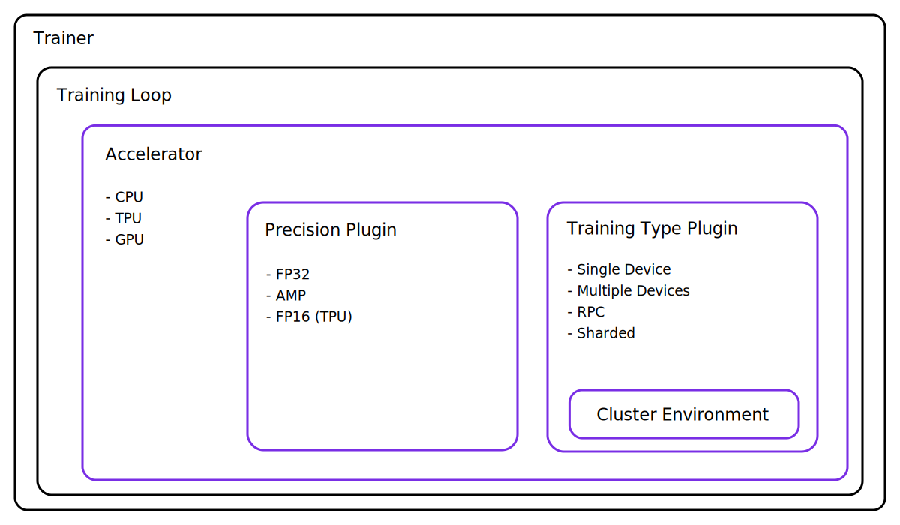

.. _plugins:

#######
Plugins
#######

Plugins allow custom integrations to the internals of the Trainer such as a custom precision or
distributed implementation.

Under the hood, the Lightning Trainer is using plugins in the training routine, added automatically
depending on the provided Trainer arguments. For example:

.. code-block:: python

    # accelerator: GPUAccelerator
    # training type: DDPPlugin
    # precision: NativeMixedPrecisionPlugin
    trainer = Trainer(gpus=4, precision=16)

We expose Accelerators and Plugins mainly for expert users that want to extend Lightning for:

- New hardware (like TPU plugin)
- Distributed backends (e.g. a backend not yet supported by
  `PyTorch <https://pytorch.org/docs/stable/distributed.html#backends>`_ itself)
- Clusters (e.g. customized access to the cluster's environment interface)

There are two types of Plugins in Lightning with different responsibilities:

TrainingTypePlugin
------------------

- Launching and teardown of training processes (if applicable)
- Setup communication between processes (NCCL, GLOO, MPI, ...)
- Provide a unified communication interface for reduction, broadcast, etc.
- Provide access to the wrapped LightningModule

PrecisionPlugin
---------------

- Perform pre- and post backward/optimizer step operations such as scaling gradients
- Provide context managers for forward, training_step, etc.
- Gradient clipping

Futhermore, for multi-node training Lightning provides cluster environment plugins that allow the advanced user
to configure Lighting to integrate with a :ref:`custom-cluster`.

**********************
Create a custom plugin
**********************

Expert users may choose to extend an existing plugin by overriding its methods ...

.. code-block:: python

    from pytorch_lightning.plugins import DDPPlugin

    class CustomDDPPlugin(DDPPlugin):

        def configure_ddp(self):
            self._model = MyCustomDistributedDataParallel(
                self.model,
                device_ids=...,
            )

or by subclassing the base classes :class:`~pytorch_lightning.plugins.training_type.TrainingTypePlugin` or
:class:`~pytorch_lightning.plugins.precision.PrecisionPlugin` to create new ones. These custom plugins
can then be passed into the Trainer directly or via a (custom) accelerator:

.. code-block:: python

    # custom plugins
    trainer = Trainer(plugins=[CustomDDPPlugin(), CustomPrecisionPlugin()])

    # fully custom accelerator and plugins
    accelerator = MyAccelerator(
        precision_plugin=CustomPrecisionPlugin(),
        training_type_plugin=CustomDDPPlugin(),
    )
    trainer = Trainer(accelerator=accelerator)

The full list of built-in plugins is listed below.

.. warning:: The Plugin API is in beta and subject to change.
    For help setting up custom plugins/accelerators, please reach out to us at **support@pytorchlightning.ai**

----------

Training Type Plugins
---------------------

.. currentmodule:: pytorch_lightning.plugins.training_type

.. autosummary::
    :nosignatures:
    :template: classtemplate.rst

    TrainingTypePlugin
    SingleDevicePlugin
    ParallelPlugin
    DataParallelPlugin
    DDPPlugin
    DDP2Plugin
    DDPShardedPlugin
    DDPSpawnShardedPlugin
    DDPSpawnPlugin
    DeepSpeedPlugin
    HorovodPlugin
    RPCPlugin
    RPCSequentialPlugin
    SingleTPUPlugin
    TPUSpawnPlugin

Precision Plugins
-----------------

.. currentmodule:: pytorch_lightning.plugins.precision

.. autosummary::
    :nosignatures:
    :template: classtemplate.rst

    PrecisionPlugin
    NativeMixedPrecisionPlugin
    ShardedNativeMixedPrecisionPlugin
    ApexMixedPrecisionPlugin
    DeepSpeedPrecisionPlugin
    TPUHalfPrecisionPlugin
    DoublePrecisionPlugin

Cluster Environments
--------------------

.. currentmodule:: pytorch_lightning.plugins.environments

.. autosummary::
    :nosignatures:
    :template: classtemplate.rst

    ClusterEnvironment
    LightningEnvironment
    TorchElasticEnvironment
    KubeflowEnvironment
    SLURMEnvironment
