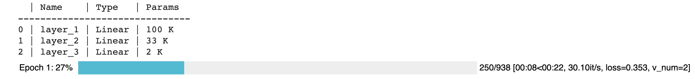
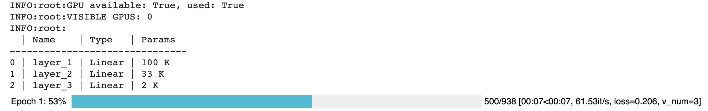

.. testsetup:: *

    from pytorch_lightning.core.lightning import LightningModule
    from pytorch_lightning.core.datamodule import LightningDataModule
    from pytorch_lightning.trainer.trainer import Trainer

.. _introduction_guide:

#########################
Step-by-step walk-through
#########################
This guide will walk you through the core pieces of PyTorch Lightning.

We'll accomplish the following:

- Implement an MNIST classifier.
- Use inheritance to implement an AutoEncoder

.. note:: Any DL/ML PyTorch project fits into the Lightning structure. Here we just focus on 3 types
    of research to illustrate.

--------------

**************************
From MNIST to AutoEncoders
**************************

Installing Lightning
====================

Lightning is trivial to install. We recommend using conda environments

.. code-block:: bash

    conda activate my_env
    pip install pytorch-lightning

Or without conda environments, use pip.

.. code-block:: bash

    pip install pytorch-lightning

Or conda.

.. code-block:: bash

    conda install pytorch-lightning -c conda-forge

-------------

The research
============

The Model
---------

The :doc:`lightning module <../common/lightning_module>` holds all the core research ingredients:

- The model

- The optimizers

- The train/ val/ test steps

Let's first start with the model. In this case, we'll design a 3-layer neural network.

.. testcode::

    import torch
    from torch.nn import functional as F
    from torch import nn
    from pytorch_lightning.core.lightning import LightningModule

    class LitMNIST(LightningModule):

      def __init__(self):
        super().__init__()

        # mnist images are (1, 28, 28) (channels, width, height)
        self.layer_1 = nn.Linear(28 * 28, 128)
        self.layer_2 = nn.Linear(128, 256)
        self.layer_3 = nn.Linear(256, 10)

      def forward(self, x):
        batch_size, channels, width, height = x.size()

        # (b, 1, 28, 28) -> (b, 1*28*28)
        x = x.view(batch_size, -1)
        x = self.layer_1(x)
        x = F.relu(x)
        x = self.layer_2(x)
        x = F.relu(x)
        x = self.layer_3(x)

        x = F.log_softmax(x, dim=1)
        return x

Notice this is a :doc:`lightning module <../common/lightning_module>` instead of a ``torch.nn.Module``. A LightningModule is
equivalent to a pure PyTorch Module except it has added functionality. However, you can use it **EXACTLY** the same as you would a PyTorch Module.

.. testcode::

    net = LitMNIST()
    x = torch.randn(1, 1, 28, 28)
    out = net(x)

.. rst-class:: sphx-glr-script-out

 Out:

 .. code-block:: python

    torch.Size([1, 10])

Now we add the training_step which has all our training loop logic

.. testcode::

    class LitMNIST(LightningModule):

        def training_step(self, batch, batch_idx):
            x, y = batch
            logits = self(x)
            loss = F.nll_loss(logits, y)
            return loss

Data
----

Lightning operates on pure dataloaders. Here's the PyTorch code for loading MNIST.

.. testcode::
    :skipif: not _TORCHVISION_AVAILABLE

    from torch.utils.data import DataLoader, random_split
    from torchvision.datasets import MNIST
    import os
    from torchvision import datasets, transforms

    # transforms
    # prepare transforms standard to MNIST
    transform=transforms.Compose([transforms.ToTensor(),
                                  transforms.Normalize((0.1307,), (0.3081,))])

    # data
    mnist_train = MNIST(os.getcwd(), train=True, download=True, transform=transform)
    mnist_train = DataLoader(mnist_train, batch_size=64)

.. testoutput::
    :hide:
    :skipif: os.path.isdir(os.path.join(os.getcwd(), 'MNIST')) or not _TORCHVISION_AVAILABLE

    Downloading ...
    Extracting ...
    Downloading ...
    Extracting ...
    Downloading ...
    Extracting ...
    Processing...
    Done!

You can use DataLoaders in 3 ways:

1. Pass DataLoaders to .fit()
^^^^^^^^^^^^^^^^^^^^^^^^^^^^^
Pass in the dataloaders to the `.fit()` function.

.. code-block:: python

    model = LitMNIST()
    trainer = Trainer()
    trainer.fit(model, mnist_train)

2. LightningModule DataLoaders
^^^^^^^^^^^^^^^^^^^^^^^^^^^^^^
For fast research prototyping, it might be easier to link the model with the dataloaders.

.. code-block:: python

    class LitMNIST(pl.LightningModule):

        def train_dataloader(self):
            # transforms
            # prepare transforms standard to MNIST
            transform=transforms.Compose([transforms.ToTensor(),
                                          transforms.Normalize((0.1307,), (0.3081,))])
            # data
            mnist_train = MNIST(os.getcwd(), train=True, download=True, transform=transform)
            return DataLoader(mnist_train, batch_size=64)

        def val_dataloader(self):
            transforms = ...
            mnist_val = ...
            return DataLoader(mnist_val, batch_size=64)

        def test_dataloader(self):
            transforms = ...
            mnist_test = ...
            return DataLoader(mnist_test, batch_size=64)

DataLoaders are already in the model, no need to specify on .fit().

.. code-block:: python

    model = LitMNIST()
    trainer = Trainer()
    trainer.fit(model)

3. DataModules (recommended)
^^^^^^^^^^^^^^^^^^^^^^^^^^^^
Defining free-floating dataloaders, splits, download instructions, and such can get messy.
In this case, it's better to group the full definition of a dataset into a `DataModule` which includes:

- Download instructions
- Processing instructions
- Split instructions
- Train dataloader
- Val dataloader(s)
- Test dataloader(s)

.. testcode::

    class MyDataModule(LightningDataModule):

        def __init__(self):
            super().__init__()
            self.train_dims = None
            self.vocab_size = 0

        def prepare_data(self):
            # called only on 1 GPU
            download_dataset()
            tokenize()
            build_vocab()

        def setup(self, stage: Optional[str] = None):
            # called on every GPU
            vocab = load_vocab()
            self.vocab_size = len(vocab)

            self.train, self.val, self.test = load_datasets()
            self.train_dims = self.train.next_batch.size()

        def train_dataloader(self):
            transforms = ...
            return DataLoader(self.train, batch_size=64)

        def val_dataloader(self):
            transforms = ...
            return DataLoader(self.val, batch_size=64)

        def test_dataloader(self):
            transforms = ...
            return DataLoader(self.test, batch_size=64)

Using DataModules allows easier sharing of full dataset definitions.

.. code-block:: python

    # use an MNIST dataset
    mnist_dm = MNISTDatamodule()
    model = LitModel(num_classes=mnist_dm.num_classes)
    trainer.fit(model, mnist_dm)

    # or other datasets with the same model
    imagenet_dm = ImagenetDatamodule()
    model = LitModel(num_classes=imagenet_dm.num_classes)
    trainer.fit(model, imagenet_dm)

.. note:: ``prepare_data()`` is called on only one GPU in distributed training (automatically)
.. note:: ``setup()`` is called on every GPU (automatically)

Models defined by data
^^^^^^^^^^^^^^^^^^^^^^
When your models need to know about the data, it's best to process the data before passing it to the model.

.. code-block:: python

    # init dm AND call the processing manually
    dm = ImagenetDataModule()
    dm.prepare_data()
    dm.setup()

    model = LitModel(out_features=dm.num_classes, img_width=dm.img_width, img_height=dm.img_height)
    trainer.fit(model, dm)

1. use ``prepare_data()`` to download and process the dataset.
2. use ``setup()`` to do splits, and build your model internals

An alternative to using a DataModule is to defer initialization of the models modules to the ``setup`` method of your LightningModule as follows:

.. testcode::

    class LitMNIST(LightningModule):

        def __init__(self):
            self.l1 = None

        def prepare_data(self):
            download_data()
            tokenize()

        def setup(self, stage: Optional[str] = None):
            # step is either 'fit', 'validate', 'test', or 'predict'. 90% of the time not relevant
            data = load_data()
            num_classes = data.classes
            self.l1 = nn.Linear(..., num_classes)

Optimizer
---------

Next we choose what optimizer to use for training our system.
In PyTorch we do it as follows:

.. code-block:: python

    from torch.optim import Adam
    optimizer = Adam(LitMNIST().parameters(), lr=1e-3)

In Lightning we do the same but organize it under the :func:`~pytorch_lightning.core.LightningModule.configure_optimizers` method.

.. testcode::

    class LitMNIST(LightningModule):

        def configure_optimizers(self):
            return Adam(self.parameters(), lr=1e-3)

.. note:: The LightningModule itself has the parameters, so pass in self.parameters()

However, if you have multiple optimizers use the matching parameters

.. testcode::

    class LitMNIST(LightningModule):

        def configure_optimizers(self):
            return Adam(self.generator(), lr=1e-3), Adam(self.discriminator(), lr=1e-3)

Training step
-------------

The training step is what happens inside the training loop.

.. code-block:: python

    for epoch in epochs:
        for batch in data:
            # TRAINING STEP
            # ....
            # TRAINING STEP
            optimizer.zero_grad()
            loss.backward()
            optimizer.step()

In the case of MNIST, we do the following

.. code-block:: python

    for epoch in epochs:
        for batch in data:
            # ------ TRAINING STEP START ------
            x, y = batch
            logits = model(x)
            loss = F.nll_loss(logits, y)
            # ------ TRAINING STEP END ------

            optimizer.zero_grad()
            loss.backward()
            optimizer.step()

In Lightning, everything that is in the training step gets organized under the
:func:`~pytorch_lightning.core.LightningModule.training_step` function in the LightningModule.

.. testcode::

    class LitMNIST(LightningModule):

        def training_step(self, batch, batch_idx):
            x, y = batch
            logits = self(x)
            loss = F.nll_loss(logits, y)
            return loss

Again, this is the same PyTorch code except that it has been organized by the LightningModule.
This code is not restricted which means it can be as complicated as a full seq-2-seq, RL loop, GAN, etc...

----------------

The engineering
===============

Training
--------
So far we defined 4 key ingredients in pure PyTorch but organized the code with the LightningModule.

1. Model.
2. Training data.
3. Optimizer.
4. What happens in the training loop.

|

For clarity, we'll recall that the full LightningModule now looks like this.

.. code-block:: python

    class LitMNIST(LightningModule):
        def __init__(self):
            super().__init__()
            self.layer_1 = nn.Linear(28 * 28, 128)
            self.layer_2 = nn.Linear(128, 256)
            self.layer_3 = nn.Linear(256, 10)

        def forward(self, x):
            batch_size, channels, width, height = x.size()
            x = x.view(batch_size, -1)
            x = self.layer_1(x)
            x = F.relu(x)
            x = self.layer_2(x)
            x = F.relu(x)
            x = self.layer_3(x)
            x = F.log_softmax(x, dim=1)
            return x

        def training_step(self, batch, batch_idx):
            x, y = batch
            logits = self(x)
            loss = F.nll_loss(logits, y)
            return loss

Again, this is the same PyTorch code, except that it's organized by the LightningModule.

Logging
^^^^^^^
To log to Tensorboard, your favorite logger, and/or the progress bar, use the
:func:`~~pytorch_lightning.core.lightning.LightningModule.log` method which can be called from
any method in the LightningModule.

.. code-block:: python

    def training_step(self, batch, batch_idx):
        self.log('my_metric', x)

The :func:`~~pytorch_lightning.core.lightning.LightningModule.log` method has a few options:

- on_step (logs the metric at that step in training)
- on_epoch (automatically accumulates and logs at the end of the epoch)
- prog_bar (logs to the progress bar)
- logger (logs to the logger like Tensorboard)

Depending on where the log is called from, Lightning auto-determines the correct mode for you. But of course
you can override the default behavior by manually setting the flags.

.. note:: Setting on_epoch=True will accumulate your logged values over the full training epoch.

.. code-block:: python

    def training_step(self, batch, batch_idx):
        self.log('my_loss', loss, on_step=True, on_epoch=True, prog_bar=True, logger=True)

You can also use any method of your logger directly:

.. code-block:: python

    def training_step(self, batch, batch_idx):
        tensorboard = self.logger.experiment
        tensorboard.any_summary_writer_method_you_want())

Once your training starts, you can view the logs by using your favorite logger or booting up the Tensorboard logs:

.. code-block:: bash

    tensorboard --logdir ./lightning_logs

Which will generate automatic tensorboard logs (or with the logger of your choice).

.. figure:: ../_static/images/mnist_imgs/mnist_tb.png
   :alt: mnist CPU bar
   :width: 500

|

But you can also use any of the :doc:`number of other loggers <../common/loggers>` we support.

Train on CPU
^^^^^^^^^^^^
.. code-block:: python

    from pytorch_lightning import Trainer

    model = LitMNIST()
    trainer = Trainer()
    trainer.fit(model, train_loader)

You should see the following weights summary and progress bar

Train on GPU
^^^^^^^^^^^^
But the beauty is all the magic you can do with the trainer flags. For instance, to run this model on a GPU:

.. code-block:: python

    model = LitMNIST()
    trainer = Trainer(gpus=1)
    trainer.fit(model, train_loader)

Train on Multi-GPU
^^^^^^^^^^^^^^^^^^
Or you can also train on multiple GPUs.

.. code-block:: python

    model = LitMNIST()
    trainer = Trainer(gpus=8)
    trainer.fit(model, train_loader)

Or multiple nodes

.. code-block:: python

    # (32 GPUs)
    model = LitMNIST()
    trainer = Trainer(gpus=8, num_nodes=4, accelerator='ddp')
    trainer.fit(model, train_loader)

Refer to the :doc:`distributed computing guide for more details <../advanced/multi_gpu>`.

Train on TPUs
^^^^^^^^^^^^^
Did you know you can use PyTorch on TPUs? It's very hard to do, but we've
worked with the xla team to use their awesome library to get this to work
out of the box!

Let's train on Colab (`full demo available here <https://colab.research.google.com/drive/1-_LKx4HwAxl5M6xPJmqAAu444LTDQoa3>`_)

First, change the runtime to TPU (and reinstall lightning).

.. figure:: ../_static/images/mnist_imgs/runtime_tpu.png
    :alt: mnist GPU bar
    :width: 400

.. figure:: ../_static/images/mnist_imgs/restart_runtime.png
    :alt: mnist GPU bar
    :width: 400

|

Next, install the required xla library (adds support for PyTorch on TPUs)

.. code-block:: shell

    !pip install cloud-tpu-client==0.10 https://storage.googleapis.com/tpu-pytorch/wheels/torch_xla-1.8-cp37-cp37m-linux_x86_64.whl

In distributed training (multiple GPUs and multiple TPU cores) each GPU or TPU core will run a copy
of this program. This means that without taking any care you will download the dataset N times which
will cause all sorts of issues.

To solve this problem, make sure your download code is in the ``prepare_data`` method in the DataModule.
In this method we do all the preparation we need to do once (instead of on every GPU).

``prepare_data`` can be called in two ways, once per node or only on the root node
(``Trainer(prepare_data_per_node=False)``).

.. code-block:: python

    class MNISTDataModule(LightningDataModule):
        def __init__(self, batch_size=64):
            super().__init__()
            self.batch_size = batch_size

        def prepare_data(self):
            # download only
            MNIST(os.getcwd(), train=True, download=True, transform=transforms.ToTensor())
            MNIST(os.getcwd(), train=False, download=True, transform=transforms.ToTensor())

        def setup(self, stage: Optional[str] = None):
            # transform
            transform=transforms.Compose([transforms.ToTensor()])
            mnist_train = MNIST(os.getcwd(), train=True, download=False, transform=transform)
            mnist_test = MNIST(os.getcwd(), train=False, download=False, transform=transform)

            # train/val split
            mnist_train, mnist_val = random_split(mnist_train, [55000, 5000])

            # assign to use in dataloaders
            self.train_dataset = mnist_train
            self.val_dataset = mnist_val
            self.test_dataset = mnist_test

        def train_dataloader(self):
            return DataLoader(self.train_dataset, batch_size=self.batch_size)

        def val_dataloader(self):
            return DataLoader(self.val_dataset, batch_size=self.batch_size)

        def test_dataloader(self):
            return DataLoader(self.test_dataset, batch_size=self.batch_size)

The ``prepare_data`` method is also a good place to do any data processing that needs to be done only
once (ie: download or tokenize, etc...).

.. note:: Lightning inserts the correct DistributedSampler for distributed training. No need to add yourself!

Now we can train the LightningModule on a TPU without doing anything else!

.. code-block:: python

    dm = MNISTDataModule()
    model = LitMNIST()
    trainer = Trainer(tpu_cores=8)
    trainer.fit(model, dm)

You'll now see the TPU cores booting up.

.. figure:: ../_static/images/mnist_imgs/tpu_start.png
    :alt: TPU start
    :width: 400

Notice the epoch is MUCH faster!

.. figure:: ../_static/images/mnist_imgs/tpu_fast.png
    :alt: TPU speed
    :width: 600

----------------

.. include:: ../common/hyperparameters.rst

----------------

Validating
----------

For most cases, we stop training the model when the performance on a validation
split of the data reaches a minimum.

Just like the ``training_step``, we can define a ``validation_step`` to check whatever
metrics we care about, generate samples, or add more to our logs.

.. code-block:: python

    def validation_step(self, batch, batch_idx):
        loss = MSE_loss(...)
        self.log('val_loss', loss)

Now we can train with a validation loop as well.

.. code-block:: python

    from pytorch_lightning import Trainer

    model = LitMNIST()
    trainer = Trainer(tpu_cores=8)
    trainer.fit(model, train_loader, val_loader)

You may have noticed the words **Validation sanity check** logged. This is because Lightning runs 2 batches
of validation before starting to train. This is a kind of unit test to make sure that if you have a bug
in the validation loop, you won't need to potentially wait for a full epoch to find out.

.. note:: Lightning disables gradients, puts model in eval mode, and does everything needed for validation.

Val loop under the hood
^^^^^^^^^^^^^^^^^^^^^^^
Under the hood, Lightning does the following:

.. code-block:: python

    model = Model()
    model.train()
    torch.set_grad_enabled(True)

    for epoch in epochs:
        for batch in data:
            # ...
            # train

        # validate
        model.eval()
        torch.set_grad_enabled(False)

        outputs = []
        for batch in val_data:
            x, y = batch                        # validation_step
            y_hat = model(x)                    # validation_step
            loss = loss(y_hat, x)               # validation_step
            outputs.append({'val_loss': loss})  # validation_step

        total_loss = outputs.mean()             # validation_epoch_end

Optional methods
^^^^^^^^^^^^^^^^
If you still need even more fine-grain control, define the other optional methods for the loop.

.. code-block:: python

    def validation_step(self, batch, batch_idx):
        preds = ...
        return preds

    def validation_epoch_end(self, val_step_outputs):
        for pred in val_step_outputs:
            # do something with all the predictions from each validation_step

----------------

Testing
-------
Once our research is done and we're about to publish or deploy a model, we normally want to figure out
how it will generalize in the "real world." For this, we use a held-out split of the data for testing.

Just like the validation loop, we define a test loop

.. code-block:: python

    class LitMNIST(LightningModule):
        def test_step(self, batch, batch_idx):
            x, y = batch
            logits = self(x)
            loss = F.nll_loss(logits, y)
            self.log('test_loss', loss)

However, to make sure the test set isn't used inadvertently, Lightning has a separate API to run tests.
Once you train your model simply call ``.test()``.

.. code-block:: python

    from pytorch_lightning import Trainer

    model = LitMNIST()
    trainer = Trainer(tpu_cores=8)
    trainer.fit(model)

    # run test set
    result = trainer.test()
    print(result)

.. rst-class:: sphx-glr-script-out

 Out:

 .. code-block:: none

        --------------------------------------------------------------
        TEST RESULTS
        {'test_loss': 1.1703}
        --------------------------------------------------------------

You can also run the test from a saved lightning model

.. code-block:: python

    model = LitMNIST.load_from_checkpoint(PATH)
    trainer = Trainer(tpu_cores=8)
    trainer.test(model)

.. note:: Lightning disables gradients, puts model in eval mode, and does everything needed for testing.

.. warning:: .test() is not stable yet on TPUs. We're working on getting around the multiprocessing challenges.

----------------

Predicting
----------
Again, a LightningModule is exactly the same as a PyTorch module. This means you can load it
and use it for prediction.

.. code-block:: python

    model = LitMNIST.load_from_checkpoint(PATH)
    x = torch.randn(1, 1, 28, 28)
    out = model(x)

On the surface, it looks like ``forward`` and ``training_step`` are similar. Generally, we want to make sure that
what we want the model to do is what happens in the ``forward``. whereas the ``training_step`` likely calls forward from
within it.

.. testcode::

    class MNISTClassifier(LightningModule):

        def forward(self, x):
            batch_size, channels, width, height = x.size()
            x = x.view(batch_size, -1)
            x = self.layer_1(x)
            x = F.relu(x)
            x = self.layer_2(x)
            x = F.relu(x)
            x = self.layer_3(x)
            x = F.log_softmax(x, dim=1)
            return x

        def training_step(self, batch, batch_idx):
            x, y = batch
            logits = self(x)
            loss = F.nll_loss(logits, y)
            return loss

.. code-block:: python

    model = MNISTClassifier()
    x = mnist_image()
    logits = model(x)

In this case, we've set this LightningModel to predict logits. But we could also have it predict feature maps:

.. testcode::

    class MNISTRepresentator(LightningModule):

        def forward(self, x):
            batch_size, channels, width, height = x.size()
            x = x.view(batch_size, -1)
            x = self.layer_1(x)
            x1 = F.relu(x)
            x = self.layer_2(x1)
            x2 = F.relu(x)
            x3 = self.layer_3(x2)
            return [x, x1, x2, x3]

        def training_step(self, batch, batch_idx):
            x, y = batch
            out, l1_feats, l2_feats, l3_feats = self(x)
            logits = F.log_softmax(out, dim=1)
            ce_loss = F.nll_loss(logits, y)
            loss = perceptual_loss(l1_feats, l2_feats, l3_feats) + ce_loss
            return loss

.. code-block:: python

    model = MNISTRepresentator.load_from_checkpoint(PATH)
    x = mnist_image()
    feature_maps = model(x)

Or maybe we have a model that we use to do generation.
A :class:`~pytorch_lightning.core.lightning.LightningModule` is also just a :class:`torch.nn.Module`.

.. testcode::

    class LitMNISTDreamer(LightningModule):

        def forward(self, z):
            imgs = self.decoder(z)
            return imgs

        def training_step(self, batch, batch_idx):
            x, y = batch
            representation = self.encoder(x)
            imgs = self(representation)

            loss = perceptual_loss(imgs, x)
            return loss

.. code-block:: python

    model = LitMNISTDreamer.load_from_checkpoint(PATH)
    z = sample_noise()
    generated_imgs = model(z)

To perform inference at scale, it is possible to use :meth:`~pytorch_lightning.trainer.trainer.Trainer.predict`
with :meth:`~pytorch_lightning.core.lightning.LightningModule.predict_step`
By default, :meth:`~pytorch_lightning.core.lightning.LightningModule.predict_step`
calls :meth:`~pytorch_lightning.core.lightning.LightningModule.forward`,
but it can be overridden to add any processing logic.

.. code-block:: python

    class LitMNISTDreamer(LightningModule):

        def forward(self, z):
            imgs = self.decoder(z)
            return imgs

        def predict_step(self, batch, batch_idx: int , dataloader_idx: int = None):
            return self(batch)

    model = LitMNISTDreamer()
    trainer.predict(model, datamodule)

How you split up what goes in :meth:`~pytorch_lightning.core.lightning.LightningModule.forward`
vs :meth:`~pytorch_lightning.core.lightning.LightningModule.training_step`
vs :meth:`~pytorch_lightning.core.lightning.LightningModule.predict_step` depends on how you want to use this model for prediction.
However, we recommend :meth:`~pytorch_lightning.core.lightning.LightningModule.forward` to contain only tensor operations with your model.
:meth:`~pytorch_lightning.core.lightning.LightningModule.training_step` to encapsulate
:meth:`~pytorch_lightning.core.lightning.LightningModule.forward` logic with logging, metrics, and loss computation.
:meth:`~pytorch_lightning.core.lightning.LightningModule.predict_step` to encapsulate
:meth:`~pytorch_lightning.core.lightning.LightningModule.forward` with any necessary preprocess or postprocess functions.

----------------

The non-essentials
==================

Extensibility
-------------
Although lightning makes everything super simple, it doesn't sacrifice any flexibility or control.
Lightning offers multiple ways of managing the training state.

Training overrides
^^^^^^^^^^^^^^^^^^

Any part of the training, validation, and testing loop can be modified.
For instance, if you wanted to do your own backward pass, you would override the
default implementation

.. testcode::

    def backward(self, use_amp, loss, optimizer):
        loss.backward()

With your own

.. testcode::

    class LitMNIST(LightningModule):

        def backward(self, use_amp, loss, optimizer, optimizer_idx):
            # do a custom way of backward
            loss.backward(retain_graph=True)

Every single part of training is configurable this way.
For a full list look at :doc:`LightningModule <../common/lightning_module>`.

----------------

Callbacks
---------
Another way to add arbitrary functionality is to add a custom callback
for hooks that you might care about

.. testcode::

    from pytorch_lightning.callbacks import Callback

    class MyPrintingCallback(Callback):

        def on_init_start(self, trainer):
            print('Starting to init trainer!')

        def on_init_end(self, trainer):
            print('Trainer is init now')

        def on_train_end(self, trainer, pl_module):
            print('do something when training ends')

And pass the callbacks into the trainer

.. testcode::

    trainer = Trainer(callbacks=[MyPrintingCallback()])

.. testoutput::
    :hide:

    Starting to init trainer!
    Trainer is init now

.. tip::
    See full list of 12+ hooks in the :doc:`callbacks <../extensions/callbacks>`.

----------------

.. include:: ../common/child_modules.rst

----------------

.. include:: ../advanced/transfer_learning.rst

----------

*********************
Why PyTorch Lightning
*********************

a. Less boilerplate
===================

Research and production code starts with simple code, but quickly grows in complexity
once you add GPU training, 16-bit, checkpointing, logging, etc...

PyTorch Lightning implements these features for you and tests them rigorously to make sure you can
instead focus on the research idea.

Writing less engineering/bolierplate code means:

- fewer bugs
- faster iteration
- faster prototyping

b. More functionality
=====================

In PyTorch Lightning you leverage code written by hundreds of AI researchers,
research engs and PhDs from the world's top AI labs,
implementing all the latest best practices and SOTA features such as

- GPU, Multi GPU, TPU training
- Multi-node training
- Auto logging
- ...
- Gradient accumulation

c. Less error-prone
===================

Why re-invent the wheel?

Use PyTorch Lightning to enjoy a deep learning structure that is rigorously tested (500+ tests)
across CPUs/multi-GPUs/multi-TPUs on every pull-request.

We promise our collective team of 20+ from the top labs has thought about training more than you :)

d. Not a new library
====================

PyTorch Lightning is organized PyTorch - no need to learn a new framework.

Learn how to :ref:`convert from PyTorch to Lightning here <converting>`.

Your projects WILL grow in complexity and you WILL end up engineering more than trying out new ideas...
Defer the hardest parts to Lightning!

----------------

********************
Lightning Philosophy
********************
Lightning structures your deep learning code in 4 parts:

- Research code
- Engineering code
- Non-essential code
- Data code

Research code
=============
In the MNIST generation example, the research code
would be the particular system and how it's trained (ie: A GAN or VAE or GPT).

.. code-block:: python

    l1 = nn.Linear(...)
    l2 = nn.Linear(...)
    decoder = Decoder()

    x1 = l1(x)
    x2 = l2(x2)
    out = decoder(features, x)

    loss = perceptual_loss(x1, x2, x) + CE(out, x)

In Lightning, this code is organized into a :doc:`lightning module <../common/lightning_module>`.

Engineering code
================

The Engineering code is all the code related to training this system. Things such as early stopping, distribution
over GPUs, 16-bit precision, etc. This is normally code that is THE SAME across most projects.

.. code-block:: python

    model.cuda(0)
    x = x.cuda(0)

    distributed = DistributedParallel(model)

    with gpu_zero:
        download_data()

    dist.barrier()

In Lightning, this code is abstracted out by the :doc:`trainer <../common/lightning_module>`.

Non-essential code
==================

This is code that helps the research but isn't relevant to the research code. Some examples might be:

1. Inspect gradients
2. Log to tensorboard.

|

.. code-block:: python

    # log samples
    z = Q.rsample()
    generated = decoder(z)
    self.experiment.log('images', generated)

In Lightning this code is organized into :doc:`callbacks <../extensions/callbacks>`.

Data code
=========
Lightning uses standard PyTorch DataLoaders or anything that gives a batch of data.
This code tends to end up getting messy with transforms, normalization constants, and data splitting
spread all over files.

.. code-block:: python

    # data
    train = MNIST(...)
    train, val = split(train, val)
    test = MNIST(...)

    # transforms
    train_transforms = ...
    val_transforms = ...
    test_transforms = ...

    # dataloader ...
    # download with dist.barrier() for multi-gpu, etc...

This code gets especially complicated once you start doing multi-GPU training or needing info about
the data to build your models.

In Lightning this code is organized inside a :doc:`datamodules <../extensions/datamodules>`.

.. tip:: DataModules are optional but encouraged, otherwise you can use standard DataLoaders
